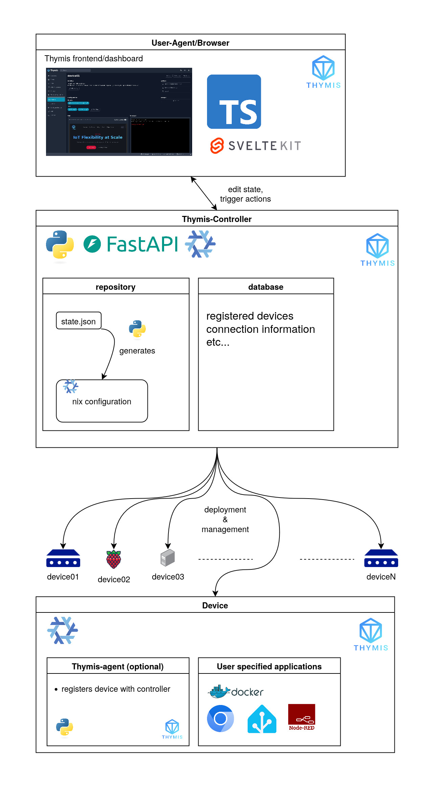

# Architecture

The Thymis platform provides a scalable and secure solution for IoT device management using the power of declarative system configuration provided by NixOS. The architecture is divided into three main components:

## Frontend/Dashboard (within User-Agent/Browser)

The frontend of Thymis is built using **SvelteKit** and **TypeScript**, offering a responsive web-based interface for interacting with the platform. This user-friendly dashboard allows administrators to provision, configure, and monitor connected devices.

The interface communicates with the backend controller using a REST API, allowing for actions like editing device states and triggering specific operations on the connected devices.

## Thymis Controller

The Thymis Controller is the core component of the platform, responsible for managing the devices and orchestrating the interactions between the frontend and the devices.

The controller is implemented using **FastAPI** and **Python**, providing a REST API for the frontend to interact with. It also communicates with the devices using SSH, as well as facilitating communication with devices using the **Thymis Agent**.

Within the controller, two stores of information are maintained:

- **Repository**: Stores the device states as a JSON file (`state.json`), which is then converted into **NixOS configurations** by the Thymis Controller. The resulting configurations are stored alongside the `state.json` file. The repository is backed by a Git repository, allowing for versioning and history tracking of device configurations.
- **Database**: Manages device metadata, including registered devices and their connection details. This enables the Thymis Controller to efficiently handle device interactions and status updates.

## Device Layer

Thymis supports the management of various devices, ranging from Raspberry Pi boards to larger servers. Each device can run specific applications defined by the user, ensuring flexibility in deployment.

We provide an optional **Thymis Agent** that can be installed on devices to facilitate secure communication and configuration management. The agent registers devices with the controller and ensures that the devices are in a known state.

Devices can run user-specified applications, such as Docker containers, or any other software that enhances the functionality and automation of the IoT setup.

## Technologies in Use

- **SvelteKit**: Frontend framework for creating a dynamic and reactive web interface.
- **FastAPI**: Backend framework for managing device configurations and data.
- **NixOS**: Declarative system configuration tool for ensuring consistency and stability in deployments.

