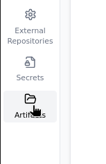
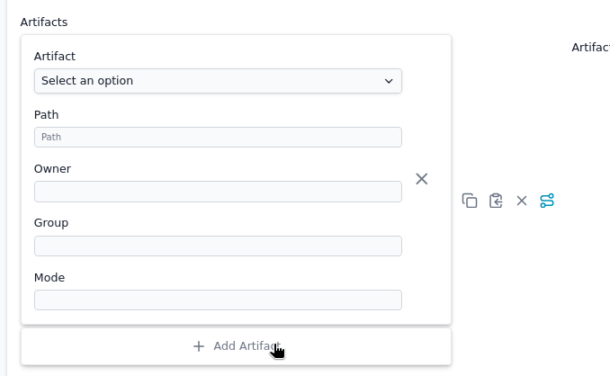

# Deploying Files using Artifacts

Artifacts in Thymis allow you to deploy files and directories to your managed devices. This is useful for distributing configuration files, scripts, certificates, or any other static files that your applications need.

## Managing Artifacts

Artifacts are managed through the **Artifacts** tab in the Thymis sidebar:

1. Navigate to **Artifacts** in the sidebar
2. Click **Create Artifact** to add a new file
3. Upload your file or enter content directly for text files
4. Name your artifact and provide an optional description



## Using Artifacts in Device Configurations

To deploy an artifact to your devices:

1. In your device configuration, add the **Core Device Configuration** module
2. Scroll to the **Artifacts** section
3. Click **Add Artifact**
4. Select the artifact you want to deploy
5. Specify the destination path on the device
6. Set permissions (owner, group, and file mode)



The artifact will be deployed to the specified path on all devices using this configuration.

## Referencing Artifacts in Custom Modules

In your custom Nix modules, you can reference artifacts using the path:

```nix
"${inputs.self}/artifacts/<artifact-name>"
```

This allows you to include artifact files in your Nix expressions:

```nix
systemd.services.my-service = {
  script = "${inputs.self}/artifacts/my-script.sh";
  # ...
};
```

## Best Practices

- Use descriptive names for artifacts to easily identify their purpose
- Organize related artifacts into directories using artifact prefixes (e.g., `configs/app.conf`)
- Set appropriate file permissions based on security requirements
- Keep artifact sizes reasonable for efficient deployment

## Security Considerations

Artifacts are stored in plain text in the project repository. For sensitive files:
- Use [Secrets](secrets.md) instead of artifacts for passwords, API keys, or certificates
- Encrypt sensitive files before adding them as artifacts
- Restrict access to the project repository if it contains sensitive artifacts

## Related Pages
- [Deploying Secrets to devices](secrets.md)
- [Creating your first Thymis module](../external-projects/thymis-modules/first-module.md)
- [Accessing the Terminal](ssh-terminal.md)
- [Reference Concepts: Artifacts](../reference/concepts/artifacts.md)
