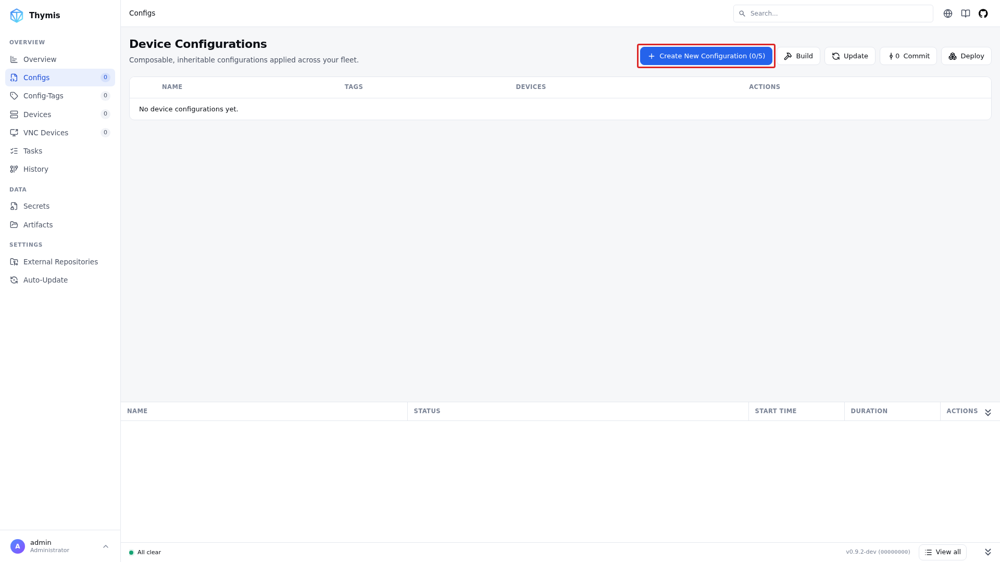
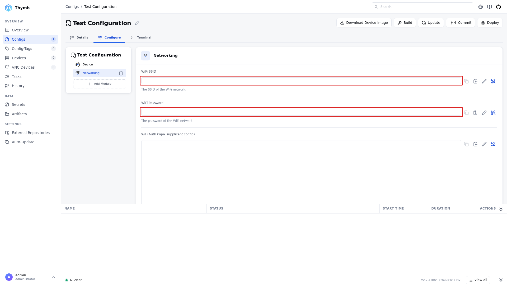
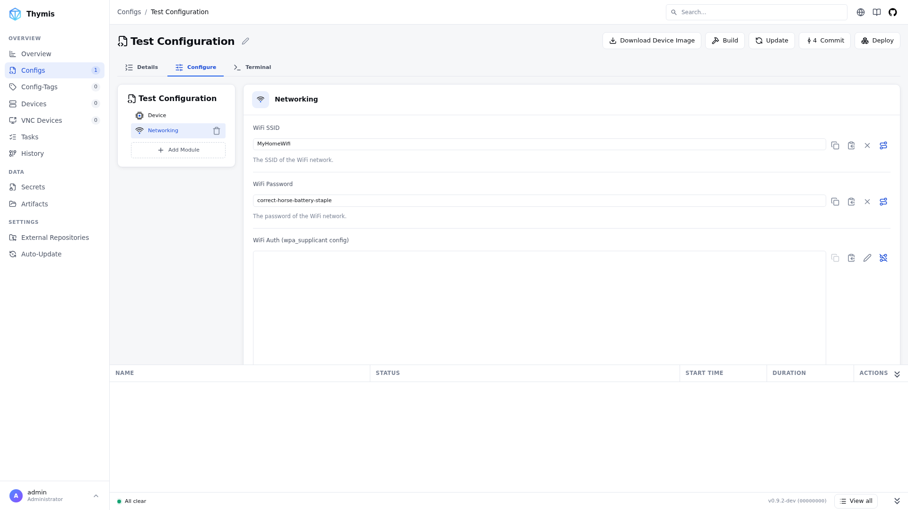
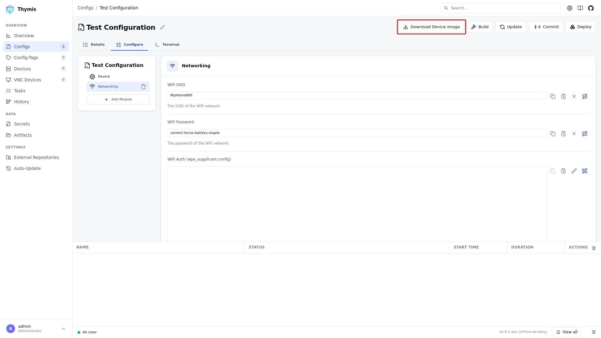
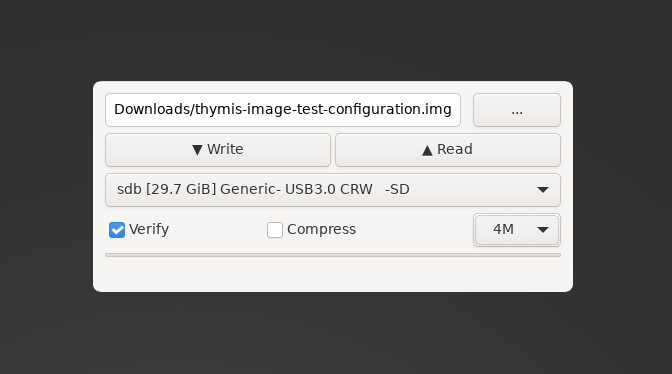
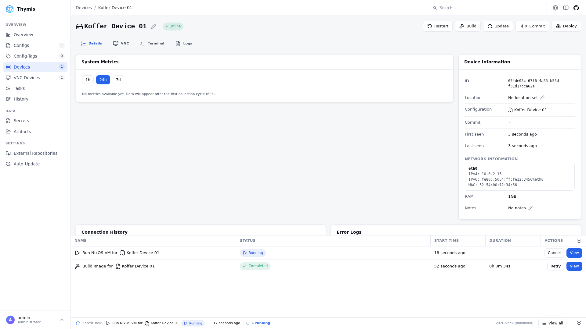

# Getting Started with Device Provisioning

This guide walks you through provisioning a Raspberry Pi, configuring networking, flashing the system image, and getting the device online with Thymis.

## Prerequisites

Before you begin, ensure you have:

- Access to a running Thymis Controller (Cloud or Self‑Hosted).
- A [supported device](../reference/supported-devices.md)
- An SD card (8 GB minimum, 32 GB recommended) or device‑specific storage.
- An SD card reader connected to your workstation.
- A stable network connection for your device. Wi‑Fi SSID and password or Ethernet LAN
- A tool for flashing images. We recommend:
  - [USBImager](https://bztsrc.gitlab.io/usbimager/) (GUI, cross‑platform)
  - `dd` (CLI, Linux/macOS).

## 1. Create a New Device Configuration

1. In the Thymis UI sidebar, click Configs.
2. Click Create New Configuration at the top right.
3. Enter a name for your configuration.
4. Select your hardware type (e.g. Raspberry Pi 4).



Once created, click Configure to open its settings.

## 2. Set Networking (Wi‑Fi)

1. Add the Networking module section
2. Enter your SSID and password.




> 💡 If you’re planning to use Ethernet (LAN), you can skip Wi‑Fi settings for now.

## 3. Download the System Image

1. At the top of the configuration page, click Download Device Image.
2. If prompted, Commit your pending changes.



Thymis will start a Build Image for Device task.

- First builds may take several minutes.
- Subsequent builds are faster thanks to caching.

When complete, a download link for the image will appear in the task output.

## 4. Flash the Image to Your Device’s Storage

Insert your SD card and use:

- **USBImagerSelect the downloaded image file and the SD card, then click _Write_.
  
- `dd` (Linux/macOS CLI):
  ```bash
  sudo dd if=/path/to/device-image.img of=/dev/sdX bs=4M status=progress conv=fsync
  ```
  > Replace `/dev/sdX` with your SD card’s device path — careful, this will erase it.

## 5. Boot the Device

1. Insert the flashed SD card into your Raspberry Pi.
2. Connect Ethernet or ensure Wi‑Fi coverage.
3. Power on the device.

Within a couple of minutes, it should connect to the Thymis Controller and appear in:

- Configs → current configuration
- Devices tab, showing live status



## Troubleshooting

If the device does not appear:

- Double‑check SSID/password in the Networking module.
- Try connecting via Ethernet for initial onboarding.
- Connect a keyboard/mouse/monitor to the device and log in as `root`
  (password from the Security & Access module).
  Use:
  ```bash
  journalctl -xe
  ```
  to review connection logs.

See [Troubleshooting Guide](troubleshooting.md) for more help.

## Next Steps

Once your device is online, you can:

- [Deploy Updates & Config Changes](update.md)
- [Share Settings via Tags](tags.md)
- [Set up a Kiosk with VNC](kiosk.md)
- [Access the Terminal](ssh-terminal.md)

## See also

- [Supported Devices](../reference/supported-devices.md)
- [Device Configuration Concept](../reference/concepts/configuration.md)
- [Deploy an Update](update.md)
- [Troubleshooting](troubleshooting.md)
