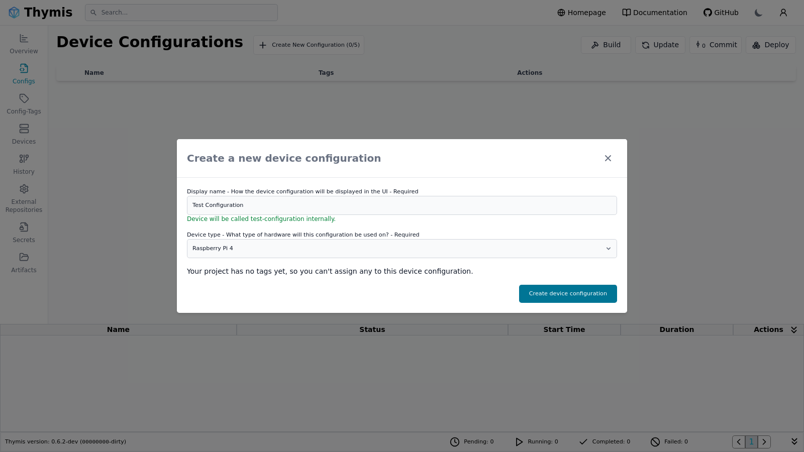
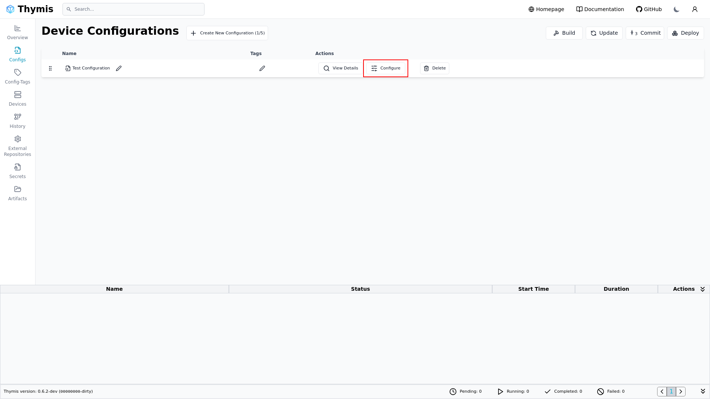

# Getting started

In this tutorial we will cover how to provision a Raspberry Pi, setup WiFi settings and flash the device.

## Create a new Configuration

Navigate to the **Config** page in the sidebar and click the **Create Device Configuration** button at the top.

A dialogue will appear where you can enter a name for the configuration and select the appropriate hardware type.

Once you click **Create Device Configuration**, the new configuration will be added to the list.
Select **Configure** to open the settings.

## Setting up WiFi

On the Core Device Settings we can set the WiFi SSID and Password.

## Downloading the System Image

Click on **Download Device Image** at the top to generate the system image.

Commit all open changes.

A new task to generate the image will be started.
Wait for the task to complete.

The first build might take a few minutes, subsequent builds will be faster because previous build steps are cached.

## Flash the Image

Insert your SD card and use a tool like **[USBImager](https://bztsrc.gitlab.io/usbimager/)** or **dd** to write the downloaded image onto your target SD card.

## Power the Device

Insert the disk or SD card into your device and power it on.

It should shortly connect to the Thymis Controller and be visible under the Configuration and Devices page.

If the device doesn't connect, make sure to check the networking settings or use a LAN connection for debugging.
See [Troubleshooting](troubleshooting.md) for more help.
