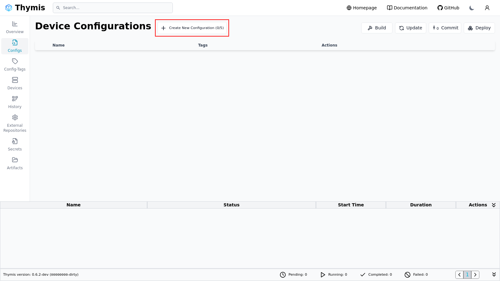

# Getting started

In this tutorial we will cover how to provision a Raspberry Pi, setup WiFi settings and flash the device.

## Create a new Configuration

Navigate to the **Config** page and click the **Create Device Configuration button at the top**.

A dialog will appear where you can enter a name for the configuration and select the appropriate hardware type.

Once you click **Create Device Configuration**, the new configuration will be added to the list.
Select **Configure** to open the settings.

## Setting up WiFi

On the Core Device Settings we can set the WiFi SSID and Password.

## Downloading the System Image

