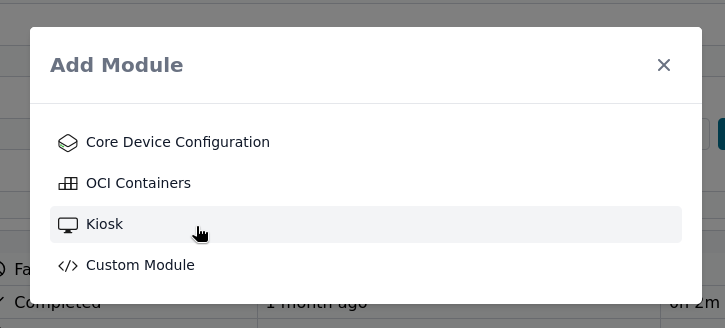
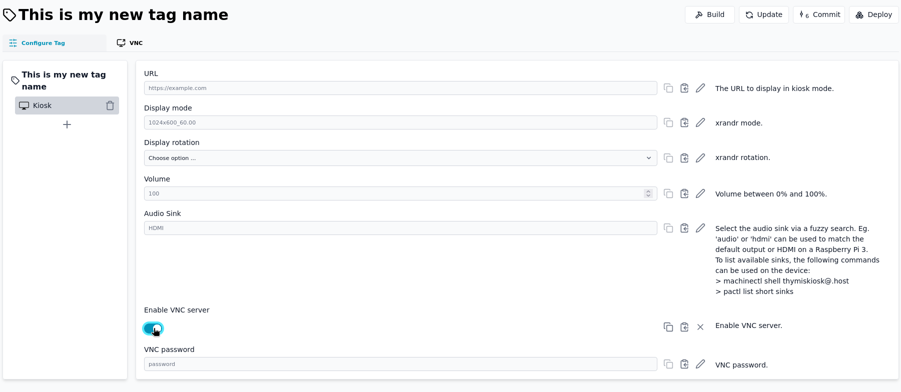
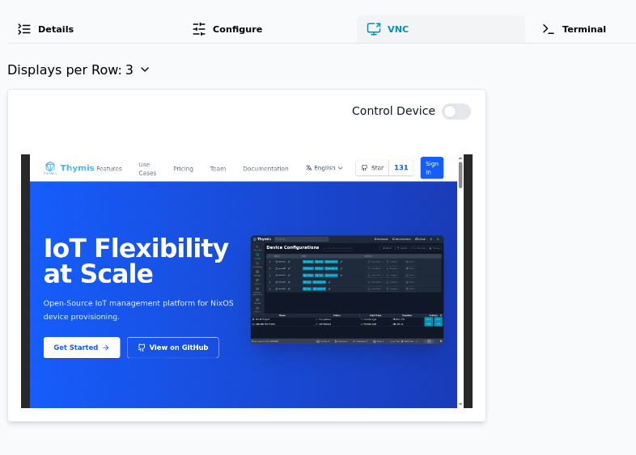

# Setting up a Kiosk with VNC

The built-in module for setting up a Kiosk allows you to enable VNC support. Custom modules can also enable VNC support, but this guide focuses on the built-in module.

## Configuring your project

Start by adding the **Kiosk** module to your device configuration directly or via a tag.

Now, set a URL to display in kiosk mode, and enable the VNC server.
Setting a password for the VNC server is optional since the VNC connection is secured by the Thymis Controller, however it is possible to set a password for the VNC server.

## Deploying the Kiosk

Click on the **Deploy** button to deploy the Kiosk configuration to your devices. Select the devices you want to deploy the Kiosk configuration to, and click on **Deploy**.

The devices will now be configured to run the Kiosk mode with the specified URL and VNC server settings.

Going to the VNC tab on the device page will show you a live view of the devices screen, and you can control the device using your mouse and keyboard once you check the **Control Device** checkbox.

