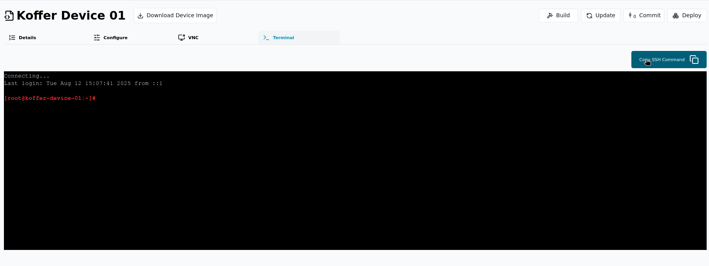

# Accessing the Terminal

Thymis provides two ways to open a terminal on your managed devices:

1. **Web terminal in the Thymis UI** (via the *Terminal* tab in a Device Configuration)
2. **Direct SSH access from your own terminal** (via the Thymis Controller)

## 1. Web Terminal in the UI

The **Terminal** tab is now available on the **Device Configuration** page and shows a list of open terminals for **all devices** associated with that configuration.

To open a web terminal:

1. Navigate to **Configs** in the sidebar.
2. Select the device configuration that contains the devices you want to access.
3. Click the **Terminal** tab.

You will see a list of devices using this configuration, along with their current terminal sessions.

## 2. Direct SSH from your own terminal

In addition to the in‑browser terminal, Thymis now supports connecting directly from your own system’s terminal — ideal for full‑screen work, advanced tooling, or file transfers.

### Prerequisites
- **SSH public key**: Add your SSH public key to the **Core Device Configuration** for the device’s configuration in the Thymis UI.
- **Nix installed locally**: [Install Nix](../external-projects/packaging-software/setting-up-nix.md) on your machine in order to use the controller’s SSH proxy tooling.

### Steps
1. Open the device’s page or the **Terminal** tab of its configuration in the Thymis UI.
2. Click **Copy SSH Command** (this copies the full `ssh` command needed to connect via the Thymis Controller).
3. Paste and run the command in your local terminal.

Thymis will tunnel the SSH connection through the Controller to your device — even if it’s behind NAT or a firewall, no inbound port setup is needed.

## Notes & Tips
- The local SSH session uses the same secure tunnel that powers the web terminal.
- Your SSH public key is **only** needed on devices where you want to allow direct external terminal connections via the Thymis Controller.
- Adding your key to the **Core Device Configuration** module makes it available to all devices using that configuration.
- The SSH command generated by Thymis includes a Token allowing access to the device, **do not share this command publicly**.

## See also
- [Setting up Nix](../external-projects/packaging-software/setting-up-nix.md)
