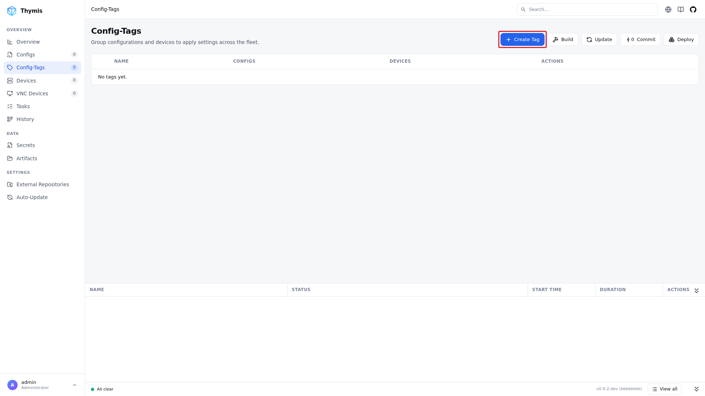
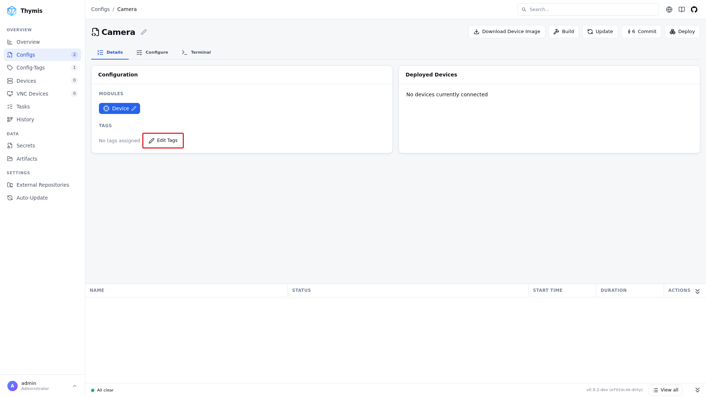
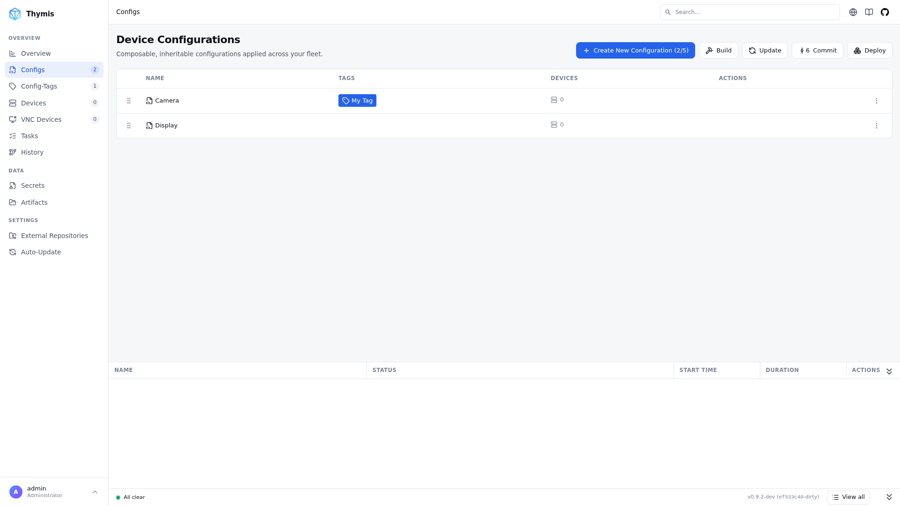
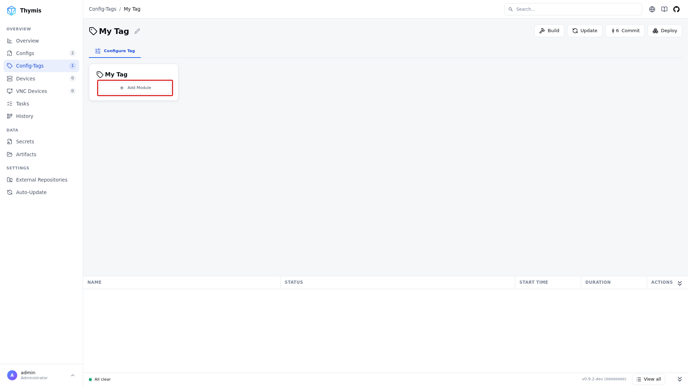
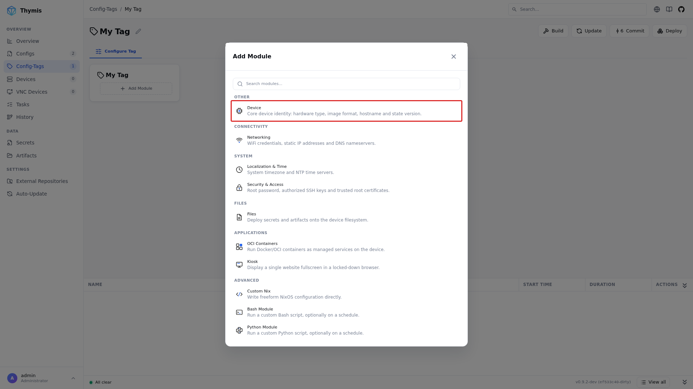
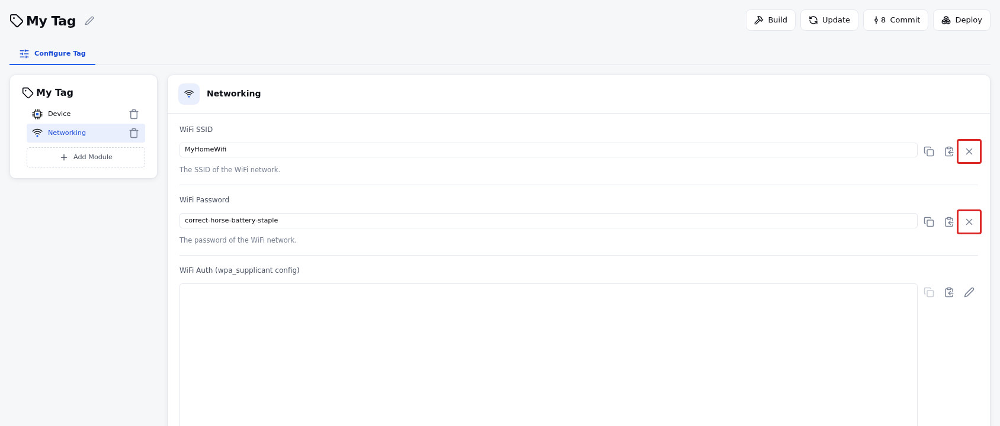

# Sharing settings via a tag

To avoid copying the same settings to multiple [configurations](../reference/concepts/configuration.md), you can use tags.

## Creating and Assigning a Tag

Navigate to **Config-Tags** and click the **Create Tag** button.
Enter a name and press Apply.

Next, go to the **Configs** page and assign the tag to one or more devices.

Your configurations should now look like this:

Any settings defined in the tag will be applied to all configurations that share this tag.

## Adding Settings to a Tag

Click on the tag to edit the settings.
You can add any module to the tag; here we add the **Device** module.

For example, you can set the Wi‑Fi SSID and password to be applied to all devices.
When adding a new device you only need to assign the tag and you’re done.
It often makes sense to split logical components into different tags (e.g., networking, specific applications) so you can reuse them when needed.

## Setting Priority

When the same module is used on both a tag and a config, the settings are merged:

- Fields of a setting merge individually, so a tag can set the Wi‑Fi SSID while the
  configuration sets the password of the same module.
- Device settings take precedence: a field the configuration sets wins over the tag's value.
  Which of two sources wins is decided by priority (the lower number wins); device
  configurations use a lower priority than tags by default.
- A field a source does not set keeps the value of the source that does, and if no source
  sets it, the module default applies. Removing a field (click the X button on the right of
  the input) means "not set by this source", so the tag's value applies:

  

- Setting a single-value field to an empty value counts as set by this source and clears the
  value of a tag (for example to remove the Wi‑Fi network a tag configures). Empty fields
  inside a list element are ignored instead, so a device configuration can add to the other
  fields of an element a tag defines.
- Lists that different sources contribute to are merged, not replaced: authorized keys,
  certificates, firewall ports, time servers and artifact rules of a tag and of a
  configuration all end up on the device.
- List settings whose elements are separate entities (static network interfaces, OCI
  containers, artifacts) merge per element, so a device configuration can add an interface
  next to the interfaces a tag defines.
