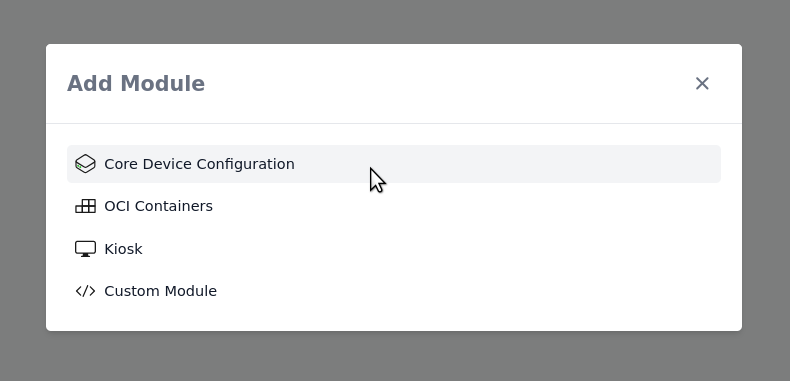

# Sharing settings via a tag

To avoid copying the same settings to multiple [configurations](../reference/concepts/configuration.md), you can use tags.

## Creating and Assigning a Tag

Navigate to **Config-Tags** and click the **Create Tag** button.
Enter a name and press Apply.

Next, go to the **Configs** page and assign the tag to one or more devices.

Your configurations should now look like this:

Any settings defined in the tag will be applied to all configurations that share this tag.

## Adding Settings to a Tag

Click on the tag to edit the settings.
You can add any module to the tag; here we add the **Core Device Configuration**.

For example, you can set the Wi‑Fi SSID and password to be applied to all devices.
When adding a new device you only need to assign the tag and you’re done.
It often makes sense to split logical components into different tags (e.g., networking, specific applications) so you can reuse them when needed.

## Setting Priority

When the same module is used on both a tag and a config, the settings are merged or overridden depending on the context.

- Generally, device settings take precedence
- Single values (e.g., Wi‑Fi SSID) are overwritten
- Lists (e.g., Authorized keys) are merged

When moving a setting from a device configuration to a tag, remove any existing device-level value to ensure the tag's value is applied.
An empty value is still treated as a set value.
Click the X button on the right to clear the field:

