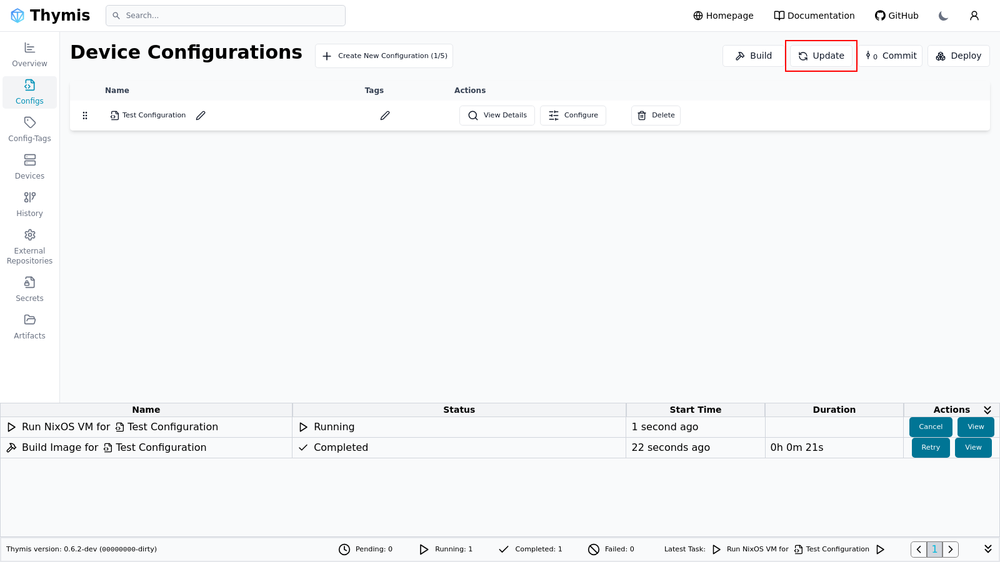
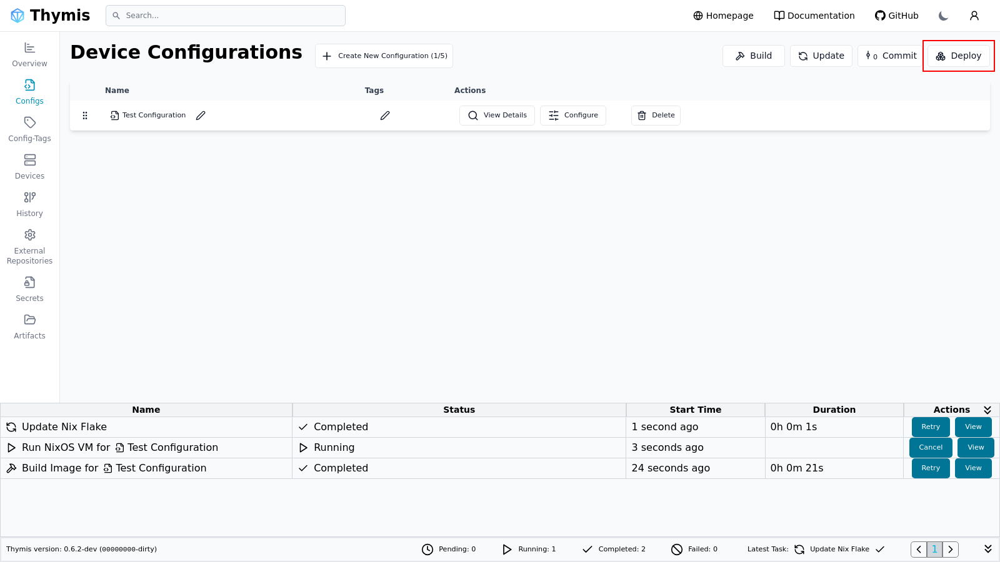
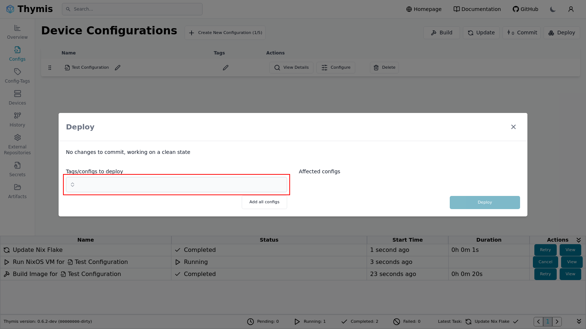

# Deploy an Update

Updates and config changes can be [deployed](../reference/concepts/deployment.md) to already connected devices.

If an update fails or the device cannot reconnect to the Thymis Controller, the previous configuration will be rolled back automatically.

## Update packages

The **Update** button updates all available packages to their latest versions.

When clicked, this creates an Update Nix Flake task.
Wait until this task completes before proceeding.

Once the update task has completed, click the **Deploy** button to push the changes to connected devices.

This opens the deploy modal where the tags/configs to deploy must be selected.
Next click deploy and wait for the deploy task to complete.

If the deployment fails, see [Troubleshooting](troubleshooting.md).
