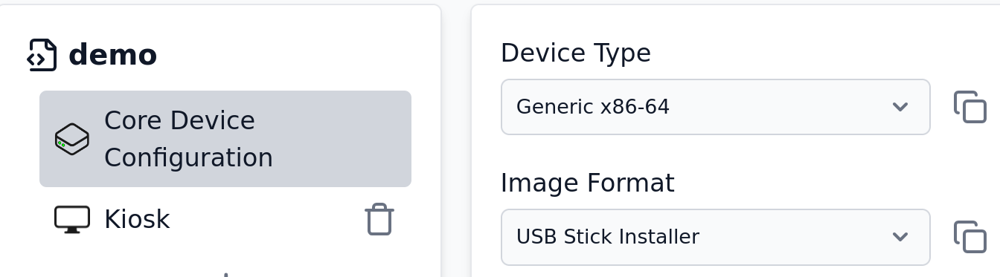

# Adding a new Type of Device

Thymis supports various device types, including Raspberry Pi and generic x86 devices. If you want to add support for a new device type, you can do so by writing Nix code.

## Using Generic Device Types and Custom Modules

You can add support for new device types by writing Nix code in a [Custom NixOS Module](./thymis-modules/nix-language-module.md) in combination with selecting a generic device type in the UI.

Then, you can configure device-specific settings in the custom module. This allows you to define the necessary configurations and packages for your new device type.

## Adding a new Device Type to Thymis itself

<!-- https://github.com/Thymis-io/thymis/blob/master/nix/devices.nix
https://github.com/Thymis-io/thymis/blob/master/nix/image-formats.nix
https://github.com/Thymis-io/thymis/blob/master/controller/thymis_controller/modules/thymis.py
-->

<!-- You can also add a new device type directly to Thymis by modifying the Nix code in the Thymis repository. This involves creating a new entry in the `devices.nix` file and defining the necessary configurations for your device type. Sometimes, adding a new device type may also require changes in the `image-formats.nix` file to support the specific image format for your device.
Then, you have to add the device type in the `thymis.py` file, which defines the **Core Device Configuration** module for Thymis Devices. -->

You can also add a new device type directly to Thymis by modifying the Nix code in the Thymis repository. This involves creating a new entry in the [`devices.nix`](https://github.com/Thymis-io/thymis/blob/master/nix/devices.nix) file and defining the necessary configurations for your device type. Sometimes, adding a new device type may also require changes in the [`image-formats.nix`](https://github.com/Thymis-io/thymis/blob/master/nix/image-formats.nix) file to support the specific image format for your device.

Then, you have to add the device type in the [`thymis.py`](https://github.com/Thymis-io/thymis/blob/master/controller/thymis_controller/modules/thymis.py) file, which defines the **Core Device Configuration** module for Thymis Devices.

If you are running a [self-hosted Thymis instance](../setting-up-thymis/self-hosted.md), you can then deploy the updated Thymis instance with the new device type support, if you are using [Thymis Cloud](../setting-up-thymis/thymis-cloud.md), you can request the Thymis team to add support for your new device type, for example by opening an issue in the [Thymis GitHub repository](https://github.com/Thymis-io/thymis/issues).

## Adding a new Device Type using Extensions (coming soon)

We plan to introduce a feature that allows users to add new device types using extensions. This will enable you to create and manage device types without modifying the core Thymis codebase. You will be able to define the necessary configurations and packages for your device type in a separate extension module, which can then be loaded into Thymis.

This feature is still in development, and we will provide more details on how to use it once it is available.
