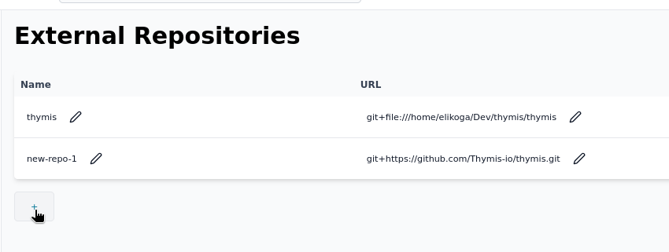

# Setting up external repositories

In Thymis, you can set up external repositories to manage your projects and modules. This allows you to package your software and integrate it with Thymis for deployment on IoT devices.

## Steps to Set Up an External Repository

### 1. Create a Git Repository

Create a Git repository for your project. This repository will contain the Nix expressions and Thymis Modules that define how to build and deploy your software.
You can use any Git hosting service, such as GitHub, GitLab, or Bitbucket.
Make sure your repository is available to Thymis, either by making it public or by providing access credentials if it is private.

Currently, using access credentials requires access to the host where Thymis is running, as Thymis does not yet support providing access credentials through the UI. If you are using a self-hosted Thymis instance, you can set up SSH keys or access tokens to allow Thymis to access your private repositories. If you are using Thymis Cloud, you can request the Thymis team to set up access to your private repositories.

### 2. Structure Your Repository

Your repository should follow a specific structure to be compatible with Thymis.
The recommended structure is:

```
my-project/
├── README.md # Project readme — must contain the string: "contains thymis modules"
├── flake.nix # Nix flake file, entry point for your Nix expressions
└── python_module_name_for_your_project/ # (optional) Directory for Thymis Python modules — make unique across projects
    ├── __init__.py # Python module init file
    └── module.py # Python module file — contains the Thymis module code
```

> ⚠️ **Security Note:** External modules run with full privileges inside the Thymis Controller environment.
> They can read/write project data, access connected devices, and execute arbitrary Nix/Python code.
> Only add external repositories from trusted sources — review their code before use.

The `python_module_name_for_your_project` directory should contain the Python module code that defines your Thymis module. It will be mounted into the module path of the Thymis Python interpreter, allowing you to import and use these modules in your Thymis modules.

Since the code from the external repository is mounted into the Thymis Python interpreter, make sure to only use trusted code in your external repository, as it will have access to all the projects and devices in Thymis.

**Ensure that your `README.md` file contains the string:**

> `contains thymis modules`

This exact text is required for Thymis to recognize your repository as a Thymis module repository.
If you do not include this string, Thymis will not be able to access the modules in your repository.

The `flake.nix` file needs to be a valid Nix flake file that defines the inputs and outputs of your project. It should include the necessary Nix expressions to build and deploy your software. You can refer to the [Nix Wiki on Flakes](https://wiki.nixos.org/wiki/Flakes) for more information on how to create a Nix flake file. The flake outputs will be mounted into the NixOS modules used by your devices under `inputs.<input-name>`.

The `module.py` file should contain the Thymis module code that defines how to deploy and manage your software on the devices. This can include configurations, dependencies, and any other necessary parameters for your project. It should contain subclasses of the `thymis_controller.modules.Module` class, which will be used by Thymis to manage your project. See the [Thymis Modules page](thymis-modules.md) for more information on how to create Thymis modules.

### 3. Add the Repository to Thymis

In the Thymis UI:

1. Navigate to **External Repositories**.
2. Click **Add Repository**.
3. Provide a unique **input name**.
4. Enter the **URL** of your Git repository.

Thymis will then fetch the repository and make its modules available for use in your Thymis projects.



You can also override the Nix code of the built-in Thymis modules by creating a `thymis` input in your flake that points to your own fork or modified version.

## Using API Keys

You can use API keys to add a private repositories.
This is supported by Github, Gitlab and should also work with arbitrary Git servers via the `Bearer <api-key>` header.

GitHub Legacy Tokens:
- Go to your [GitHub Settings](https://github.com/settings/profile)
- Navigate to Developer Settings -> Personal Access Tokens -> Tokens (classic)
- Generate new token with at least the `repo` scope

GitHub Fine-Grained Tokens:
- Go to your [GitHub Settings](https://github.com/settings/profile)
- Navigate to Developer Settings -> Personal Access Tokens -> Fine-grained tokens
- Generate new token with at least the `Contents: Read` permission for the repository

GitLab Access Tokens:
- Go to your [GitLab User Settings](https://gitlab.com/-/user_settings/profile)
- Navigate to Access Tokens
- Generate new token with at least the `read_repository` scope

You can assign different API keys to different inputs, and these will be used for the specific API calls.
However, access tokens are scoped to the host in flake fetches and updates, not a specific repository.
For example, setting a token for a GitHub host sets `github.com=23ac...b289` internally, which will then be used for all GitHub repositories.
See [Nix Config access-tokens](https://nix.dev/manual/nix/2.24/command-ref/conf-file.html#conf-access-tokens) for more information.

### 4. Use the Modules in Your Projects

Once your external repository is added, you can use its modules in your Thymis projects.
Add them to **device configurations** or **tags**, just like built‑in modules.

## See also

- [Reference: External repositories/Inputs](../reference/concepts/repositories.md) — background & technical details
