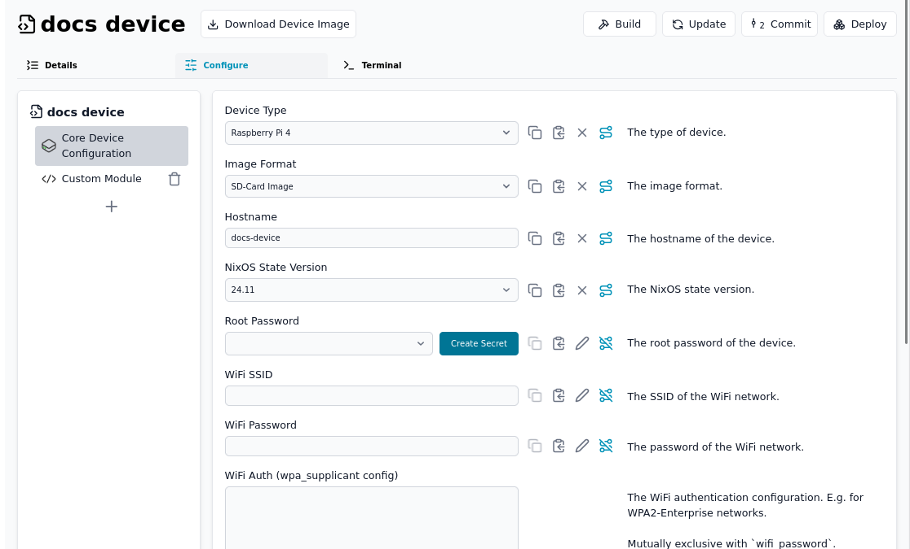
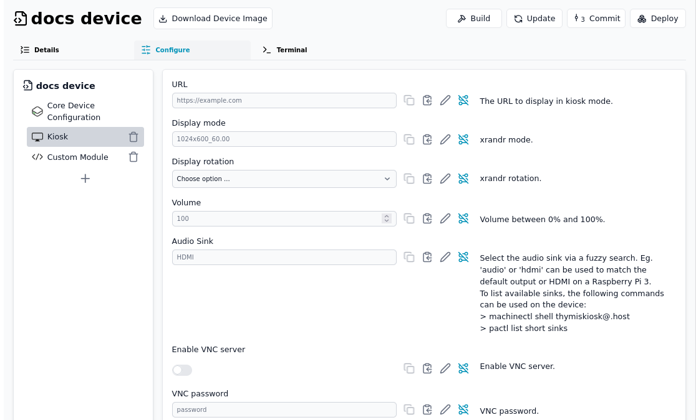
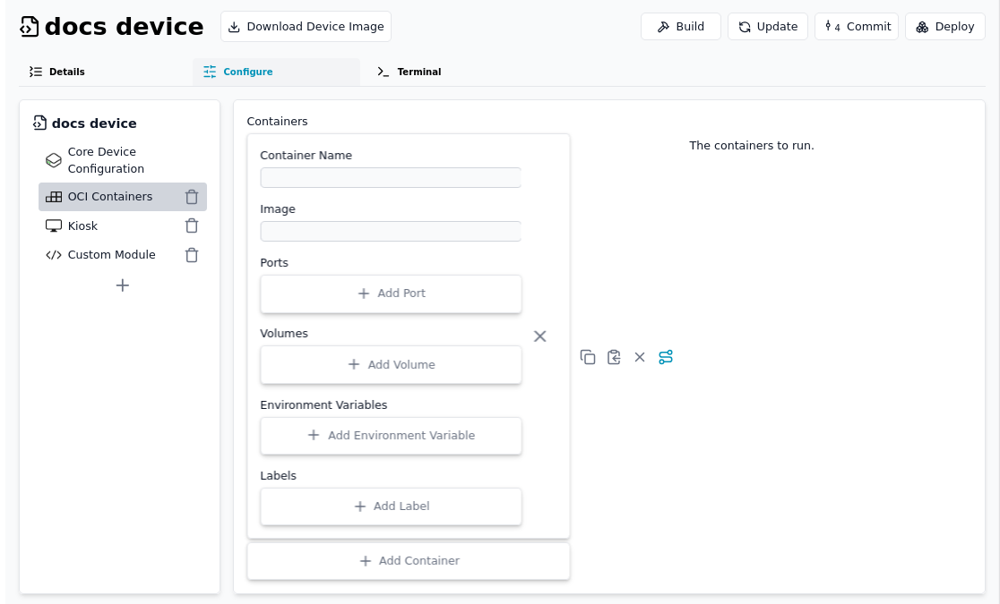
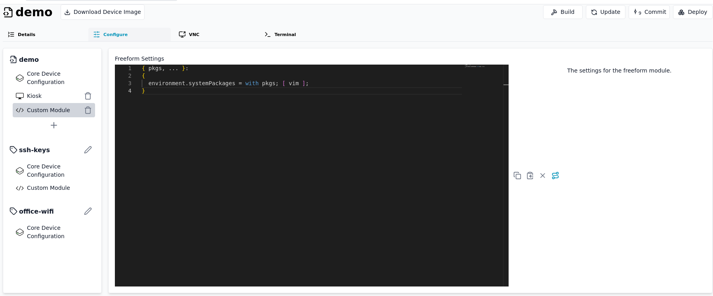

# Thymis Modules

Thymis modules are the building blocks of device configurations, allowing you to define how your devices should be configured and what software they should run. Each module provides a set of settings and configurations that can be applied to devices or tags, enabling you to create reusable and shareable device configurations.

## Built-in Modules

Thymis comes with several built-in modules that cover common use cases for IoT device management.

### Core Device Configuration

The Core Device Configuration module provides essential settings for all Thymis-managed devices. This module is required for every device configuration and includes:

- **System settings**: Hostname, timezone, and locale configuration
- **Network configuration**: WiFi settings, static IP configuration, and DNS settings
- **User management**: Configuration for the default user account
- **Security settings**: SSH access configuration and password policies
- **System services**: Configuration for essential system services

This module must be added to every device configuration and cannot be removed. It provides the foundation upon which other modules build their configurations.

### Kiosk

The Kiosk module is designed for devices that need to run a single application in fullscreen mode, such as digital signage or information displays. It includes:

- **Display settings**: Configuration for screen resolution and orientation
- **Window manager**: Pre-configured i3 window manager optimized for kiosk mode
- **VNC server**: Optional remote access for monitoring and control

The Kiosk module is ideal for devices that need to run a single application without user intervention or additional desktop interfaces.

### OCI-Containers

The OCI-Containers module allows you to deploy and manage containerized applications on your devices. It includes:

- **Docker integration**: Configuration for Docker daemon and container management
- **Container deployment**: Definition of containers to run on the device
- **Network configuration**: Container networking options and port mappings
- **Storage management**: Volume configuration and persistent storage options

This module enables you to run isolated applications in containers, simplifying application deployment and dependency management.

### Custom Nix Module

The Custom Nix Module provides advanced users with the ability to write custom NixOS configuration directly in the Thymis UI. This module is ideal for:

- **Advanced configuration**: Settings not available through other modules
- **Custom package management**: Installing specific packages not available in the module system
- **System service configuration**: Defining custom systemd services
- **Hardware-specific settings**: Configuration for specialized hardware

The Custom Nix Module accepts raw Nix expressions that are included directly in the device's NixOS configuration, giving you full control over your device's configuration.

## Creating Custom Modules

In addition to the built-in modules, you can create your own custom modules to suit your specific needs. Custom modules can be written in Python or Nix and can include:

- **Custom settings**: Define your own configuration options
- **Application deployment**: Package and deploy your own applications
- **Hardware integration**: Configure specialized hardware
- **Service management**: Define and manage custom services

For more information on creating custom modules, see [Creating your first Thymis module](thymis-modules/first-module.md).

## Module Priority and Inheritance

When multiple modules are applied to a device, their configurations are merged based on a priority system:

1. Device-specific configurations have the highest priority
2. Tag configurations have medium priority
3. Module defaults have the lowest priority

This priority system ensures that device-specific settings can override tag settings, which can in turn override module defaults.

## See also

- [Creating your first Thymis module](thymis-modules/first-module.md)
- [Using the Nix language module](thymis-modules/nix-language-module.md)
- [Using the Python language module](thymis-modules/python-language-module.md)
- [Setting up external repositories](external-repositories.md)
- [Device Configuration](../reference/concepts/configuration.md)
