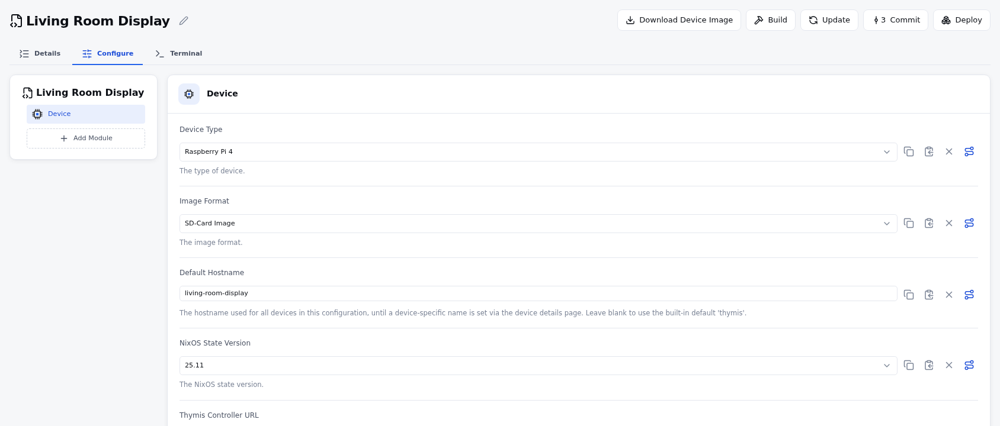
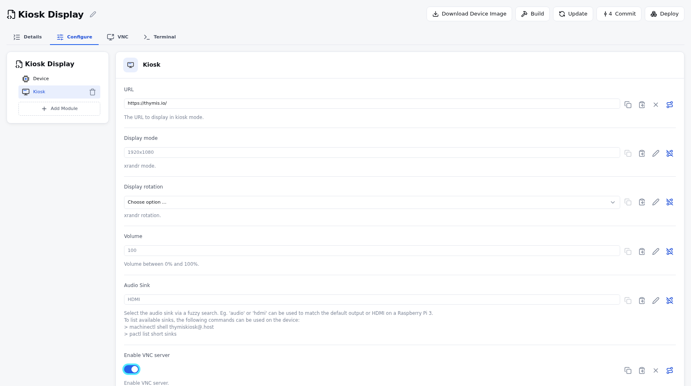
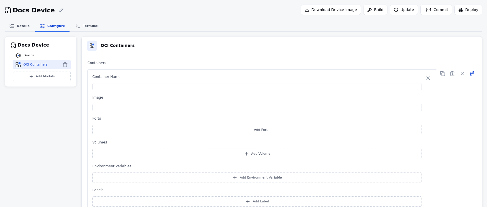
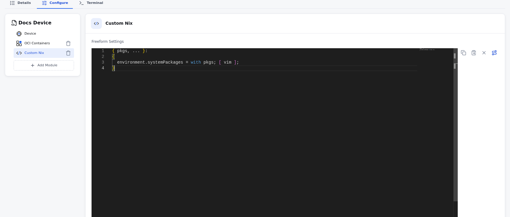

# Thymis Modules

Thymis modules are the building blocks of device configurations, allowing you to define how your devices should be configured and what software they should run. Each module provides a set of settings and configurations that can be applied to devices or tags, enabling you to create reusable and shareable device configurations.

## Built-in Modules

Thymis comes with several built-in modules that cover common use cases for IoT device management.

### Device

The Device module provides essential settings for all Thymis-managed devices. This module is required for every device configuration and includes:

- **System settings**: Hostname, timezone, and locale configuration
- **Network configuration**: WiFi settings, static IP configuration, and DNS settings
- **User management**: Configuration for the default user account
- **Security settings**: SSH access configuration and password policies
- **System services**: Configuration for essential system services



This module must be added to every device configuration and cannot be removed. It provides the foundation upon which other modules build their configurations.

### Kiosk

The Kiosk module is designed for devices that need to run a single application in fullscreen mode, such as digital signage or information displays. It includes:

- **Display settings**: Configuration for screen resolution and orientation
- **Window manager**: Pre-configured i3 window manager optimized for kiosk mode
- **VNC server**: Optional remote access for monitoring and control



The Kiosk module is ideal for devices that need to run a single application without user intervention or additional desktop interfaces.

### OCI-Containers

The OCI-Containers module allows you to deploy and manage containerized applications on your devices. It includes:

- **Docker integration**: Configuration for Docker daemon and container management
- **Container deployment**: Definition of containers to run on the device
- **Network configuration**: Container networking options and port mappings
- **Storage management**: Volume configuration and persistent storage options



This module enables you to run isolated applications in containers, simplifying application deployment and dependency management.

### Custom Nix Module

The Custom Nix Module provides advanced users with the ability to write custom NixOS configuration directly in the Thymis UI. This module is ideal for:

- **Advanced configuration**: Settings not available through other modules
- **Custom package management**: Installing specific packages not available in the module system
- **System service configuration**: Defining custom systemd services
- **Hardware-specific settings**: Configuration for specialized hardware



The Custom Nix Module accepts raw Nix expressions that are included directly in the device's NixOS configuration, giving you full control over your device's configuration.

## Creating Custom Modules

In addition to the built-in modules, you can create your own custom modules to suit your specific needs. Custom modules can be written in Python or Nix and can include:

- **Custom settings**: Define your own configuration options
- **Application deployment**: Package and deploy your own applications
- **Hardware integration**: Configure specialized hardware
- **Service management**: Define and manage custom services

For more information on creating custom modules, see [Creating your first Thymis module](thymis-modules/first-module.md).

## Module Priority and Inheritance

When multiple modules are applied to a device, their configurations are merged based on a priority system:

1. Device-specific configurations have the highest priority
2. Tag configurations have medium priority
3. Module defaults have the lowest priority

This priority system ensures that device-specific settings can override tag settings, which can in turn override module defaults.

## Settings of a Module From an External Repository

The settings of a module are merged by the NixOS module system, so that a tag and a device
configuration can each set different fields of the same module, and a setting a source does
not set keeps the value of the source that does. A module takes part in that by declaring
where its settings live in the generated configuration:

```python
class MyModule(thymis_controller.modules.Module):
    # namespace of this module's settings in the generated nix
    settings_namespace = "my-module"

    url = thymis_controller.modules.Setting(
        display_name="URL",
        # where the setting is written; keep `thymis.config.<namespace>.<name>`
        nix_attr_name="thymis.config.my-module.url",
        type="string",
        default="https://example.com",
    )

    containers = thymis_controller.modules.Setting(
        display_name="Containers",
        nix_attr_name="thymis.config.my-module.containers",
        # elements that are entities of their own merge per element, keyed by
        # this field of the element
        type=thymis_controller.modules.ListType(
            settings={...}, element_name="Container", element_key="name"
        ),
    )
```

The controller writes every setting as `lib.mkOverride <priority>` definitions and publishes
the priority of each setting as `thymis.config._priority.<namespace>.<name>`, so the module
derives its NixOS configuration from the *merged* settings and keeps the priority:

```python
    # the nix code that derives the configuration from the merged settings; the
    # controller writes it into the `modules` directory of the project
    nix_derivation_source = """
{ config, lib, ... }:
let
  settings = import ../module-settings.nix { inherit config lib; };
in
{
  systemd.services.my-service.description =
    settings.apply "my-module" "url" "https://fallback";
}
"""

    def write_nix_settings(self, f, path, module_settings, priority, project):
        # the settings of this module instance, with their priorities
        super().write_nix_settings(f, path, module_settings, priority, project)
```

The helpers in `module-settings.nix` (`settings`, `value`, `isSet`, `priority`, `priorityOf`,
`used`, `lowestPriority`, `apply`, `override`, `overrideOf`) are documented in
[Thymis Module](../reference/concepts/module.md#how-settings-reach-the-device); the
controller copies the file into the `modules` directory of the project next to the
derivation, so the derivation imports it relative to itself. Instead of providing the
derivation as source, a module can ship a NixOS module in its own repository and import it:
the flake outputs of an external repository are available as `inputs.<input-name>` in the
generated configuration, so `imports = [ inputs.<input-name>.nixosModules.my-module ];` is
enough (and that nix module imports the helpers from the `modules` directory of the
project).

Two things to keep in mind:

- Configuration derived from several settings at once (for example a file built from a URL
  and a title) should use `settings.overrideOf`/`settings.lowestPriority`, so it carries the
  lowest priority of the settings it comes from.
- A list option that other modules contribute to as well (`systemd.tmpfiles.rules`, firewall
  ports, authorized keys) must be written *without* `lib.mkOverride`, because a priority on
  a list option replaces the definitions of all other sources instead of merging with them.

## See also

- [Creating your first Thymis module](thymis-modules/first-module.md)
- [Using the Nix language module](thymis-modules/nix-language-module.md)
- [Using the Python language module](thymis-modules/python-language-module.md)
- [Using the Bash language module](thymis-modules/bash-language-module.md)
- [Setting up external repositories](external-repositories.md)
- [Device Configuration](../reference/concepts/configuration.md)
