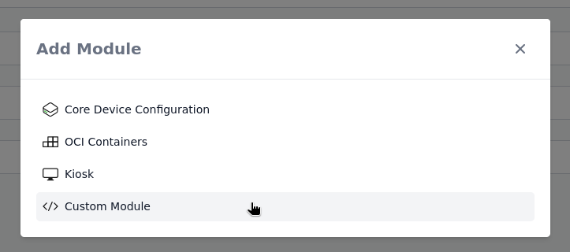

# Using the Nix Language Module

The Nix Language Module allows you to write Nix expressions to configure devices directly in Thymis. This is particularly useful when you are testing out some options or want to quickly prototype a configuration without creating a full Thymis Module.

Start by adding a "Custom Module" to your device or tag. You can do this by clicking on the **Plus** button in the **Modules** section of the device or tag configuration page.



Once added, you can select the **Custom Module** from the list of loaded modules. In the configuration section, you will find a text area where you can write your Nix expressions.


The configuration you write here will be placed in the body of a NixOS module, which is then applied to the device when it is deployed.

The exact template used is:

```nix
{ pkgs, lib, inputs, config, ... }:
{
  # Your NixOS module configuration goes here
}
```

So you can write `environment.systemPackages = with pkgs; [ vim ];` to install the `vim` package on the device and make it available in the terminal.

Like this:


For guidance on how to write NixOS modules, you can refer to the [Nix 101 - Configuring Devices with Nix](../../external-projects/packaging-software/nix-101.md#configuring-devices-with-nix)

You can consult different resource online, such as the [NixOS wiki](https://wiki.nixos.org/wiki/NixOS_modules) or the [NixOS manual](https://nixos.org/manual/nixos/stable/) to learn more about how to write NixOS modules and what options are available.

We recommend using the [Nixpkgs search](https://search.nixos.org/packages) to find available packages and the [NixOS options search](https://search.nixos.org/options) to find available configuration options.
