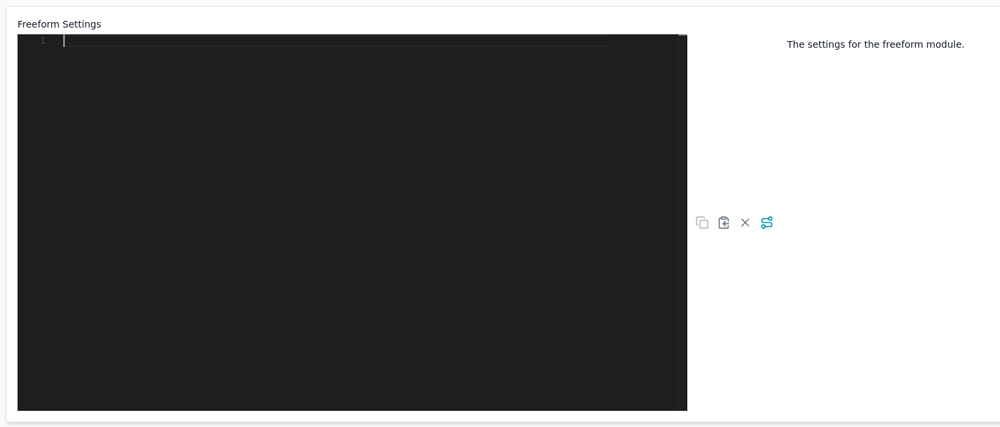

# Using the Nix language module

The **Nix language module** allows you to write NixOS modules directly in Thymis device configurations or tags.
This is particularly useful for testing options quickly or prototyping a configuration without creating a standalone Thymis module.

## Adding the module

Start by adding a **Custom Module** to your device configuration or tag.
Do this by clicking the **+ Add Module** button in the **Modules** section of the configuration or tag page.


Once added, you will see the **Custom Module** in the list of modules.
Its configuration section provides a text editor where you can write your Nix expression.



## Writing a full NixOS module (recommended)

The editor accepts a **complete NixOS module** in the usual function/attribute set form:

```nix
{ pkgs, lib, inputs, config, ... }:

{
  environment.systemPackages = with pkgs; [ vim htop ];
  services.openssh.enable = true;
}
```


This is the recommended way of using the Nix language module, since it matches the standard NixOS module structure used in `configuration.nix` and flake-based systems.

## Legacy style: only the module body

For backwards compatibility, you may also provide only the body of a module:

```nix
environment.systemPackages = with pkgs; [ vim ];
```

This will continue to work, but is not the recommended style for new projects.

## Example

For example, to install Vim on a device:

```nix
{ pkgs, ... }:
{
  environment.systemPackages = with pkgs; [ vim ];
}
```

Like this:


## Notes

- Device configurations created this way are merged with other modules and tags, following the usual [priority rules](../thymis-modules.md#module-priority-and-inheritance).

## Further resources

- [Nix 101 – Configuring Devices with Nix](../../external-projects/packaging-software/nix-101.md#configuring-devices-with-nix)
- [NixOS manual](https://nixos.org/manual/nixos/stable/) — complete overview of NixOS options
- [Nixpkgs search](https://search.nixos.org/packages) — to look up available packages
- [NixOS options search](https://search.nixos.org/options) — to explore configuration options
