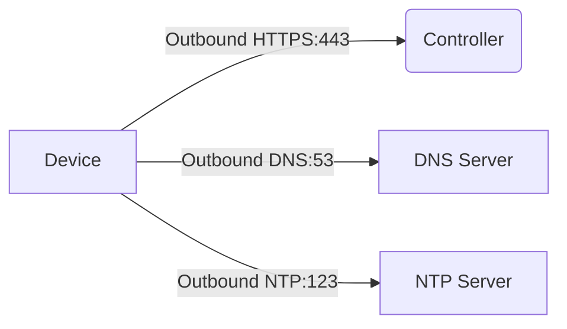
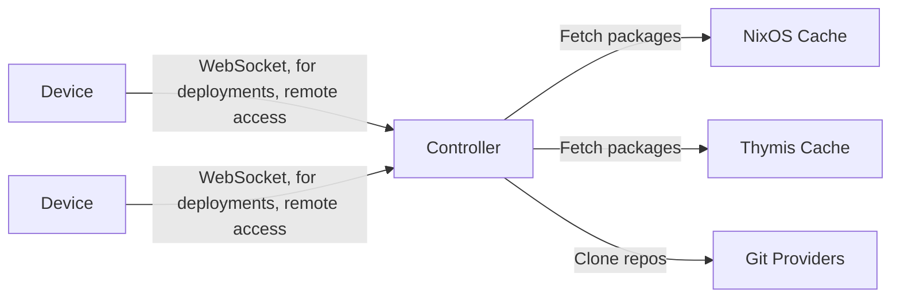
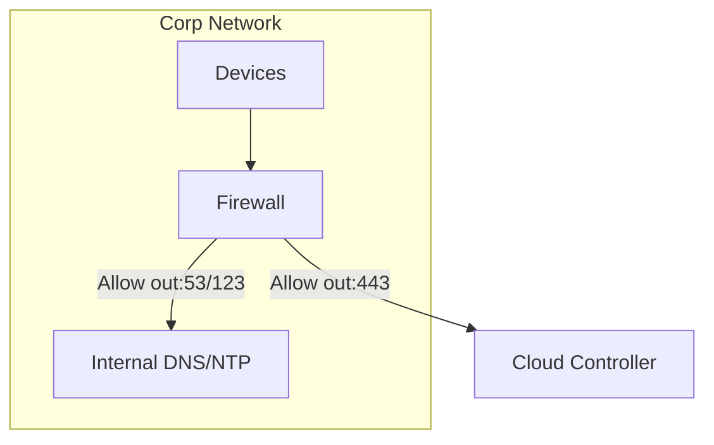

# Firewall Rules

## Device Requirements

For devices to connect to Thymis Controller, ensure outbound access to:

| Service           | Port  | Protocol | Purpose                                                             |
| ----------------- | ----- | -------- | ------------------------------------------------------------------- |
| Thymis Controller | 443   | TCP      | Main communication endpoint over HTTPS                              |
| DNS Resolution    | 53    | UDP/TCP  | Domain name resolution (critical for certificate validation)        |
| NTP               | 123   | UDP      | Time synchronization (required for TLS certificate validity checks) |
| DHCP (optional)   | 67/68 | UDP      | Dynamic IP assignment if not using static IPs                       |

> Security Note: Devices don't require any inbound ports. Thymis agents connect exclusively via outbound WebSockets.



## Controller Requirements

For self-hosted controllers, ensure outbound access to:

| Destination          | Port | Protocol | Purpose                                    |
| -------------------- | ---- | -------- | ------------------------------------------ |
| cache.nixos.org      | 443  | TCP      | Nix package cache                          |
| cache.thymis.io      | 443  | TCP      | Thymis package cache                       |
| github.com           | 443  | TCP      | Fetch external repositories                |
| Git hosting services | 443  | TCP      | Access project repositories (GitLab, etc.) |



Ensure the controller is reachable from devices via HTTPS on port 443.

## Network Scenarios

### Standard Deployment



### Air-Gapped Environment

1. Configure internal mirrors for:
   - DNS/NTP servers
   - Nix package cache (mirror of `cache.nixos.org`)
   - Thymis package cache (mirror of `cache.thymis.io`)
2. Update device configurations to use internal resources via [Custom Nix Modules](../../external-projects/thymis-modules/nix-language-module.md)

## Verification

Test connectivity from devices:

```bash
# Verify controller access
curl -vI https://YOUR_CONTROLLER_DOMAIN

# Confirm DNS resolution
nslookup YOUR_CONTROLLER_DOMAIN

# Check NTP sync
timedatectl show | grep NTPSynchronized
```

If devices fail to connect:

1. Check the [Troubleshooting guide](../../device-lifecycle/troubleshooting.md#device-doesnt-connect)
2. Verify the firewall allows outbound TLSv1.2+ connections
3. Ensure DNS resolves to the correct controller IP

## Security Recommendations

1. Restrict controller access to organization IP ranges
2. Consider certificate pinning for device‑controller communication
3. Monitor traffic for `thymis-controller` user agent patterns

For detailed network configuration:

- [Self-hosted setup guide](../../setting-up-thymis/self-hosted.md)
- [Cloud Setup](../../setting-up-thymis/thymis-cloud.md)
