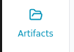
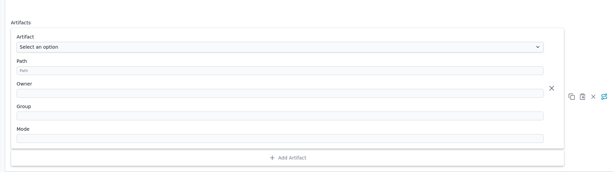

# Artifacts

Artifacts are managed in the Thymis UI under the "Artifacts" tab. They are used to deploy files to devices, such as configuration files, scripts, or any other necessary files that need to be present on the device.

Artifacts are added directly to the devices configuration in the `artifacts/` subdirectory of the project repository. Each artifact is defined in a separate file, and the content of the file is the content of the artifact.
One can upload, download, and delete artifacts directly from the UI.

Referencing to an artifact in Nix Code can be done by writing `"${inputs.self}/artifacts/<artifact-name>"`. This allows you to include the artifact in the device's configuration, ensuring that it is available when the device is deployed or updated.

To include an artifact in your device's file system, you can use the **Artifacts** configuration option in your device's **Core Device Configuration** module. Specify the artifact to place, the path where it should be placed, and the permissions (owner, group, and mode) for the file.

Artifacts should not be used for secrets or sensitive data. For sensitive data, use the [Secrets](secret.md) feature instead, which provides secure storage and access control.
