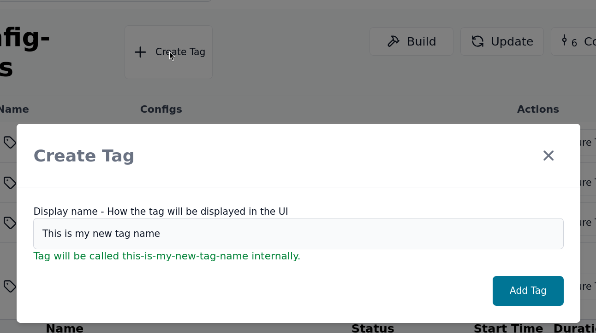
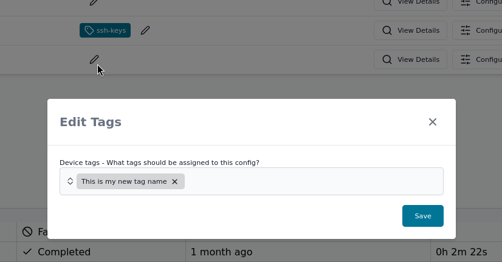
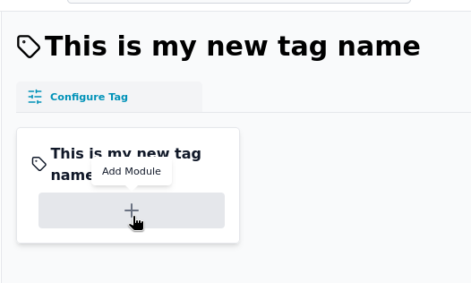

# Tag

In Thymis, a **Tag** is a way to apply a set of modules to a device configuration. Tags allow you to group related modules together, making it easier to manage and apply configurations across multiple devices.

When you create a tag, the associated NixOS modules are generated into the project's `tags/<tag-name>/<module-name>.nix` file. This file contains the NixOS options and configurations that will be applied to devices that have this tag.

## Creating a Tag

In the Thymis UI, you can create a tag by navigating to the "Config-Tags" section and clicking on "Create Tag". You will be prompted to enter a name for the tag and select the modules you want to include in it.

You can see the internal name of the tag in the creation modal, which is used in the project repository to reference the tag.

## Using a Tag

Once you have created a tag, you can apply it to a device configuration. In the device configuration page, click the pen icon in the **Tags** section to edit the tags for the device.

Select the tags you want to apply to the device and click "Save". The selected tags will be applied to the device configuration, and the associated NixOS modules will be included in the device's configuration.

You can view all the tags in the "Config-Tags" section of the Thymis UI. Each tag will show the device configurations that have it applied, and buttons to edit or delete the tag.
When you click on a Tag or on the "Edit" button, you will be able to see the NixOS modules that are included in the tag.

Click on the "Add Module" button to add a new module to the tag. You can select from the available modules in your project.
