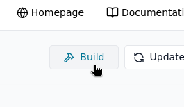
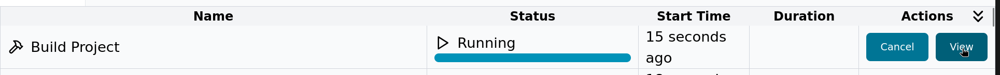

# Build

In the main toolbar, you will find the **Build** button.

Unlike [**Commit**](commit.md), **Build** does not require you to commit your changes first — you can build at any time based on the current uncommitted state of your project.

## What does Build do?

Clicking **Build** will:

- Build all the derivations/paths required for **over‑the‑air (OTA)** deployment to a device.
- **Not** produce a full installation image — it only prepares the system closure for deployment to existing devices.
- Run NixOS **assertions** and **sanity checks** to verify that your configuration is valid.
- Validate all currently loaded Nix code for your project and modules.

This lets you quickly check whether your current configuration is internally consistent and will build successfully before committing or deploying it.

## When to use Build

Use **Build** to:

- Test and sanity‑check your configuration changes locally in Thymis before deploying them.
- Catch Nix syntax errors, wrong option names, or failed derivations early.
- Verify that module changes from tags, device configurations, or external repositories integrate correctly.

## Tasks and Results

When you trigger a build, Thymis creates a **Build Project** task visible in the **Tasks** view.

- If the build **succeeds**: Your project builds without issues and is ready to be deployed OTA.
- If the build **fails**: Click **View** on the task in the **Tasks** table to inspect the full build log and determine the cause.

You can also view the task at any time during execution by clicking **View** on the task in the **Tasks** table.

Common causes for build failures include:
- Typographical errors in Nix expressions.
- Missing packages or incorrect package names.
- Invalid option names or mutually exclusive options set in modules.

**Tip:** Running **Build** frequently when making iterative changes helps catch errors early in the development process.

## After Build

Once the build completes successfully, you can proceed with:
- [**Commiting**](commit.md) your changes to save them in the repository.
- [**Deploying**](deploy.md) the built closure to your devices for testing or production use.
- Continue making further changes and repeat the build process as needed.
