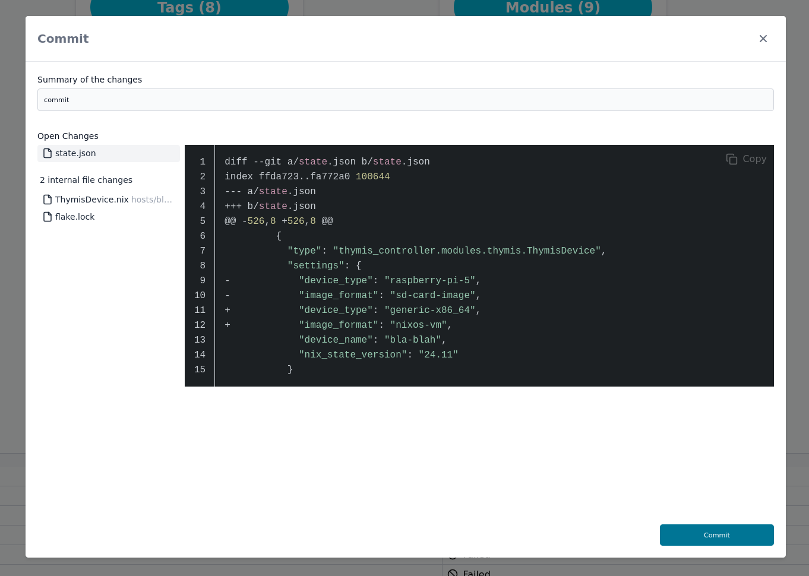

# Commit

In the main toolbar, you will find the **Commit** button.

The number of files changed is shown as the number in the button.

Clicking this button will open the **Commit** dialog, where you can review your changes and commit them to the repository backing your project, which holds your device configurations.

You can enter a commit message and view the files that have been changed. A pre-written commit message is provided, but you can edit it to your liking.

Once you are satisfied with the changes, click the **Commit** button to commit the changes to the repository.

The number in the button should now be zero, indicating that there are no uncommitted changes.
