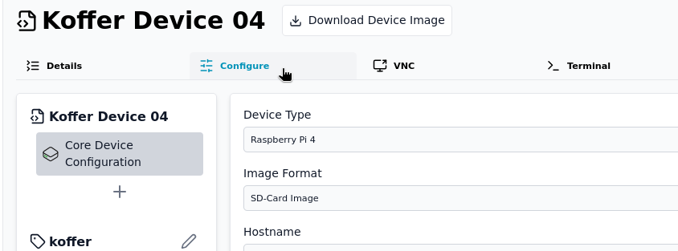

# Configuring Device Modules in Thymis

When designing device configurations in Thymis, you interact with **modules** – reusable components defining specific functionality. These modules can be applied to either:

1. Individual **[Device Configurations](../concepts/configuration.md)**
2. Shared **[Tags](../concepts/tag.md)**

### 1. Adding Modules

- **Navigate** to your device config or tag
- Go to the **Configure** tab
- Click **+ Add Module**
- Select from built-in modules (e.g., `Core Device Settings`, `Kiosk`) or custom modules
- Repeat to combine multiple modules per config/tag

### 2. Configure Tab Interface

After selecting a module, access its settings via the **Configure** tab:

- **Module Panel** (left): List of all modules in this config/tag
- **Settings Panel** (right): Editable fields for selected module
- **X Button**: Clear custom values (resets to module default)
- **Visibility Logic**: Settings may show/hide based on dependencies (e.g., enabling WiFi reveals SSID/password fields)

### 3. Setting Types

Each module exposes settings of specific types:

| **Type**   | **UI Control**                            | Example Use Case        |
| ---------- | ----------------------------------------- | ----------------------- |
| `bool`     | Toggle switch                             | Enable/disable features |
| `string`   | Text input                                | Hostnames, URLs         |
| `int`      | Number input                              | Port numbers, timeouts  |
| `textarea` | Multi-line text                           | Scripts, config files   |
| `select`   | Dropdown menu                             | Protocol selection      |
| `list`     | Dynamic item array                        | Network interfaces      |
| `secret`   | [Secure selector](../concepts/secrets.md) | API keys, passwords     |
| `artifact` | [File selector](../concepts/artifacts.md) | Certificates, scripts   |

**Custom Controls:**

- Click 🔍 to browse artifacts/secrets
- For `list` types: Use ⊕ to add items, ⛌ to remove

### **4. Key Interactions**

- **Clearing Values**:
  Click **X** beside any field to revert to its default.
  _Note: An empty field ≠ unset value – explicitly clear to disable overrides._

- **Cross-Module Dependencies**:
  Settings in different modules merge according to precedence rules:
  Device-specific values > Tag values > Module defaults

- **Debug Conflicts**:
  Icon indicators warn when values are overridden by higher-priority entries

### See Also

- [Modules: Core Concepts](../concepts/module.md) – Structure of Thymis modules
- [Artifact Management](../concepts/artifacts.md) – Store reusable files
- [Secret Handling](../concepts/secrets.md) – Secure credential patterns
- [Tag Inheritance Flow](../../device-lifecycle/tags.md) – Settings priority explained

> **Pro Tip**: Use Nix Language Module when UI controls are insufficient – [Custom Nix Configuration](../../external-projects/thymis-modules/nix-language-module.md) offers full flexibility.
