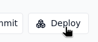
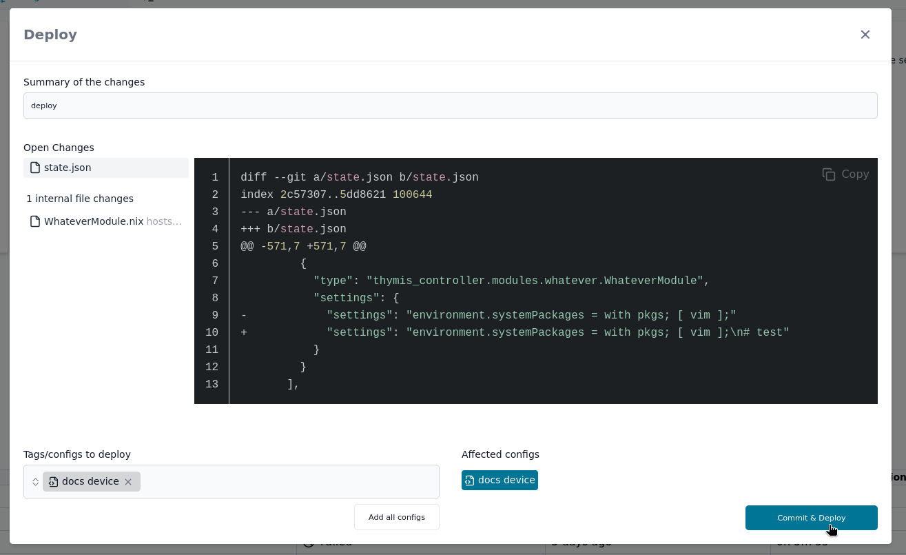
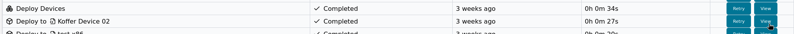

# Deploy

In the main toolbar, you will find the **Deploy** button, which is central to pushing configurations and updates to your devices.

Clicking **Deploy** opens the Deploy Modal, which allows you to commit changes and deploy to selected devices or tags in a single workflow.

## The Deploy Modal

The Deploy Modal shows you the current state of your project and lets you commit and deploy in one unified process.

### Viewing and Committing Changes

If you have uncommitted changes, the modal displays them with:
- A list of modified files
- A commit message field with a pre-filled message that you can edit
- Two options based on your changes:
  - **Commit & Deploy**: Button when you have uncommitted changes
  - **Deploy**: Button when your repository is clean (committed previously)

Selecting options will commit your changes (if needed) before deploying.

### Selecting Targets

You can deploy to:
- **Specific device configurations** by selecting them in the list
- **Tags** by clicking on them, and all associated device configurations will be included

The affected device configurations and their devices are shown in the preview section, so you can confirm where your changes will be applied.

## Deployment Process

Deploying can be done in different ways:

### Over-the-Air (OTA) updates
- Incremental updates that only transfer modified system changes
- Atomic switching to new configurations after successful update
- Minimal downtime and bandwidth usage
- Automatic rollback on failure detection

### Full Image Replacement
- Complete system replacement for air-gapped environments or recovery scenarios
- Manual installation process

## Three-Phase Deployment
In Thymis, deployment follows a three-phase approach for each device:

### 1. Build Phase
- The device's unique configuration is built into a deployable system closure
- This is optimized for incremental changes to minimize bandwidth usage
- Based on your current project state (either committed or included in the commit)

#### 2. Copy/Transfer Phase
- The new system closure is transferred to the device
- Only new paths are sent, minimizing data transfer
- Secured via the established WebSocket connection

### 3. Switch/Activate Phase
- The device atomically switches to the new system closure
- Previous configuration is preserved as a rollback point
- Device reboots or activates the new configuration

## Reliability and Recovery

Thymis implements several mechanisms to ensure reliability:

- **Automatic rollback** occurs if:
  - A deployment fails during the switch phase and the device loses connection
  - The device cannot reconnect to the controller after deployment
- Previous configuration is preserved as a rollback point to ensure device stability

## Task Management

During deployment, Thymis creates two levels of tasks:

- **Deployment Task**: Overall task for the entire deployment operation
- **Per-Device Tasks**: Individual tasks for each device being deployed

You can monitor progress in the **Tasks** view, where each device's deployment status is tracked separately. Tasks show current phase, progress, and any error messages.

## Current Limitations

Thymis has some limitations in deployment error handling:

- **Partial failures**: If a systemd service fails to start, the deployment may be marked as failed even though the system has already switched. You can verify this by:
  1. Checking the commit hash in the **Devices** table—it shows which configuration is running
  2. Using the **Terminal** to inspect device logs
  3. reviewing the deployment task logs

This limitation will be addressed in future UI improvements for better deployment status visibility.

## Best Practices

Before deploying:
1. **Review changes** carefully in the modal to ensure you're deploying to the right devices
2. **Test critical changes** on a single device first using the **Build** button
3. **Deploy during maintenance windows** for large-scale changes

After deployment:
- Monitor the **Tasks** view for any failures
- Check device connectivity in the **Devices** view
- Use the **Terminal** to verify services are running correctly

## Related Pages

- [Build](build.md): Verify configurations before deploying
- [Tasks](tasks.md): Monitor deployment progress
- [Accessing the Terminal](../../device-lifecycle/ssh-terminal.md): Check device status after deployment
- [Troubleshooting](../../device-lifecycle/troubleshooting.md): Resolve common deployment issues
