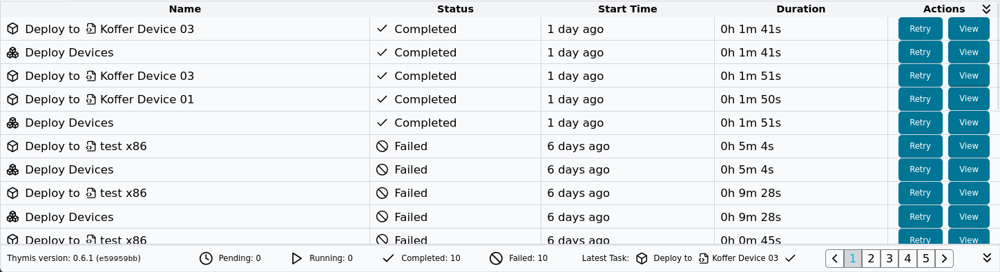
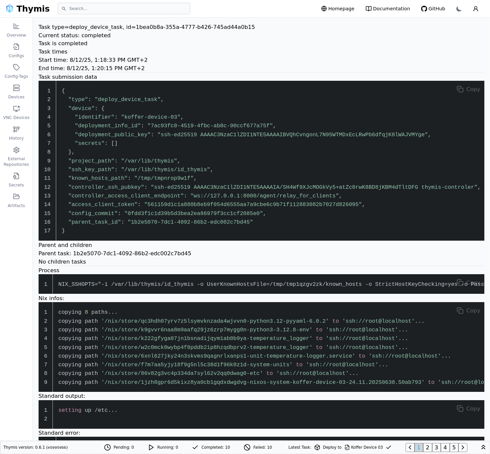

# Tasks

Thymis provides a **task system** to track long-running operations such as builds, updates, deployments, and image generation. All background operations in Thymis appear as tasks in the bottom **Tasks** view.

## Task Status

| State     | Meaning                                                                              |
| --------- | ------------------------------------------------------------------------------------ |
| Pending   | The task is waiting for resources to start.                                          |
| Running   | The task is currently executing.                                                     |
| Completed | The task finished successfully without errors.                                       |
| Failed    | The task ended due to an error. The failure reason can be found in the task details. |

## Task Types

| Task Type                                       | Description                                                            |
| ----------------------------------------------- | ---------------------------------------------------------------------- |
| [Build Project](build.md)                       | Builds the project configuration and validates all Nix code.           |
| [Deploy to Device](../concepts/deployment.md)   | Deploys a configuration to a single device.                            |
| Deploy Devices                                  | The parent task for Deploy Devices, grouping all deployments together. |
| [Update Nix Flake](update.md)                   | Updates project dependencies to their latest versions.                 |
| [Build Image for Device](../concepts/device.md) | Creates a bootable system image for a specific device configuration.   |
| Run SSH Command                                 | Executes a one-time command on a device over SSH.                      |
| Run NixOS VM for Device                         | Starts a virtual machine instance with a selected configuration.       |

## Task Details

Opening a task shows more information such as:
- Submission Data: all information used to process the task
- Process: the command that was executed and its arguments
- Nix Infos, Warnings, Errors: parsed Nix output, separated by log level
- Standard output: logs generated during execution
- Standard error: warnings and error messages from the process

