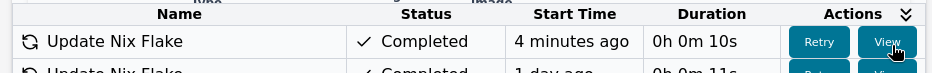

# Update

In the main toolbar, you will find the **Update** button.

> **Important:** The **toolbar “Update”** updates your *project’s external inputs* (Nix Flake dependencies such as `nixpkgs`, Thymis modules, and external repositories).
> It **does not** directly update or redeploy the applications/configurations on your devices.
> To push newer versions of software or configuration to devices, see [Deploy an Update](../../device-lifecycle/update.md).

Unlike [**Commit**](commit.md) or [**Build**](build.md), which focus on your immediate project changes, **Update** specifically manages the external dependencies (called *inputs*) in your project.
In the background, this command runs `nix flake update` to fetch the latest revisions of all declared inputs.

## What does Update do?

Clicking **Update** will:

- Fetch the latest available versions of all Nix Flake inputs in your project
- Update your `flake.lock` file with the new input revisions
- Automatically rebuild your project with the new inputs

This is particularly useful when:

- You want to get the latest versions of upstream packages or tools
- You depend on external repositories that have released new features or bug fixes
- You need to apply security patches from nixpkgs or other inputs

## Inputs in Thymis

Inputs include:

- The base Thymis repository
- External repositories added via [External Repositories](../../external-projects/external-repositories.md)
- Any other Git repository used in your Nix expressions

When you add an external repository to your project, it becomes an input that can be updated.

## Tasks and Results

When you trigger an update, Thymis creates an **Update Inputs** task in the **Tasks** view.

- If the update **succeeds**: Your project is rebuilt with the new inputs, and your `flake.lock` is updated.
- If the update **fails**: Click **View** on the task in the **Tasks** table to inspect the logs.

Common issues during updates include:
- Incompatible changes in external repositories
- Network connectivity problems
- SHA256 mismatches during Git fetches

## When to use Update

Use **Update** to:

- Keep your project dependencies current with upstream changes
- Pull in security updates from nixpkgs and other critical inputs
- Access new features or bug fixes from modules in external repositories
- Resolve issues that might be fixed in newer versions of dependencies

## After Update

Once the update completes successfully:

1. Review the changes in the Commit dialogue
2. Click **Commit** to save the new `flake.lock` and any rebuild changes
3. Optionally, test updated configurations with **Build**
4. [Deploy Updates](../../device-lifecycle/update.md) if you also want to apply changes to devices

> **Reminder:** Running the toolbar **Update** only changes what is *available* to your configurations. Devices will not change until you commit & deploy.

## Best Practices

- Test updates with **Build** before committing and deploying to production devices
- Review changelogs of critical inputs before updating
- Consider updating to stable releases rather than always using latest
- Start with a small subset of devices when testing updates that might change significant functionality
