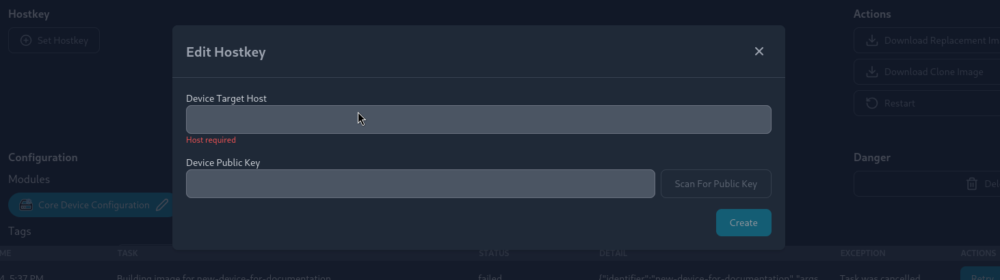

# Adding an existing NixOS device

If you already have a NixOS device that you want to manage with Thymis, you can easily add it to the Thymis controller. This allows you to monitor and update the device configuration remotely.

## Prerequisites

Before adding an existing device to Thymis, make sure that you have the following:

- A running Thymis controller
- SSH access to the device you want to add
- The device's IP address or hostname

## Steps to Add an Existing Device

To add an existing NixOS device to Thymis, follow these steps:

### Step 1: Access the Thymis Dashboard

1. Open your web browser and navigate to the Thymis dashboard.
2. Log in with your credentials.


### Step 2: Add a New Device

1. Click on the **Configurations** tab in the sidebar.
2. Select **Create New Configuration**.
3. Fill in the required details, such as the device name, hardware model, as well as tags to associate with the device.


### Step 3: Configure your device to accept connections from the Thymis controller

The Thymis controller has a deployment key that allows it to connect to devices and deploy configurations. In most configurations the public key should be in `/var/lib/thymis/id_thymis.pub`.

Access this file and add the public key to the device's root user's `authorized_keys`.
On NixOS, this option can be added to the `configuration.nix` file:

```nix
{
    users.users.root.openssh.authorizedKeys.keys = [
    "ssh-ed25519 ... thymis-controller"
    ]
}
```

Deploy the new configuration to the device.

### Step 4: Add the device to Thymis

1. In the **Devices** tab, select **View Details** for the device you just created.
2. Select **Set Hostkey** and enter the device's IP address or hostname.
3. Click **Scan For Public Key** to retrieve and save the device's public key.
4. Click **Create** to associate the device with the Thymis controller.



### Step 5: Deploy Thymis-managed configuration to the device

1. Click on **Deploy** to push the Thymis-managed configuration to the device.
2. The device will now be managed by Thymis and can be updated remotely.

Congratulations! You have successfully added an existing NixOS device to Thymis. You can now manage and update the device configuration from the Thymis dashboard.
