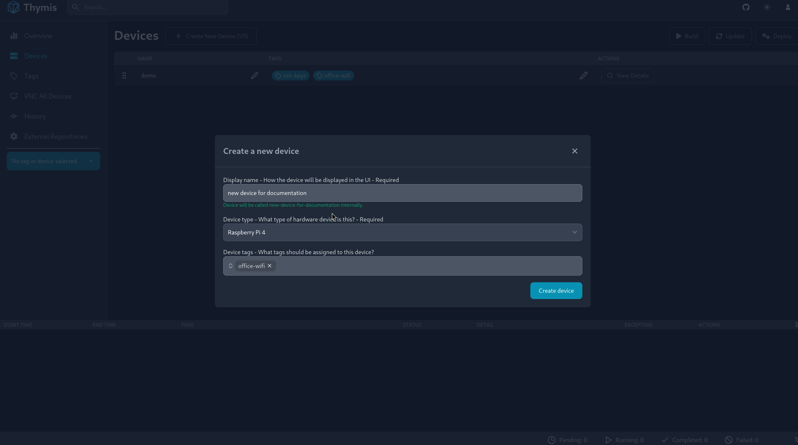
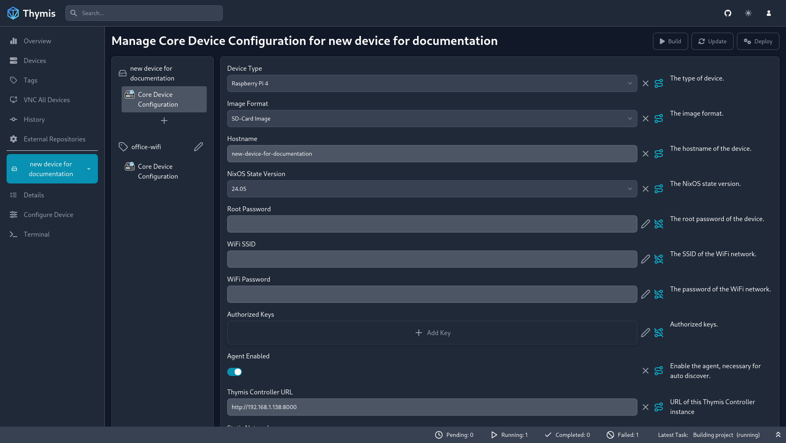
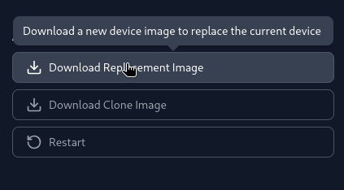
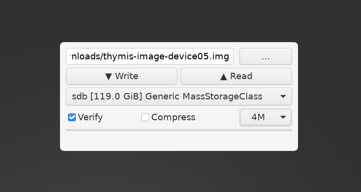

# Provisioning a New Device

Provisioning a new device with Thymis involves creating a fully-configured disk or SD card image for your NixOS system. This process ensures that each device boots up with the exact configuration specified, making deployments quick and consistent.

## Step 1: Access the Thymis Dashboard
1. Open your web browser and navigate to the Thymis dashboard.
2. Log in with your credentials.

## Step 2: Create a New Device Configuration!
1. Click on the **Configurations** tab in the sidebar.
2. Select **Create New Configuration**.
3. Fill in the required details, such as the device name, hardware model, as well as tags to associate with the device.

## Step 3: Configure the Device Settings
1. In the **Configurations** tab, select **View Details** for the device configuration you just created.
2. Click on **Core Device Configuration** to access the device configuration interface.
3. Use the graphical interface to set up the NixOS modules and services you want to include in your device's image.
4. Save the configuration when done.

## Step 4: Generate the Disk/SD Card Image
1. Once your device settings are configured, navigate back to the device details page.
2. Click on **Download Replacement Image** to generate the disk or SD card image for your device.
3. A task is created to generate the image. Wait for the task to complete.
3. Download the generated image to your local machine.

## Step 5: Deploy the Image to Your Device
1. Use a tool like [**USBImager**](https://bztsrc.gitlab.io/usbimager/) or **dd** to write the downloaded image onto your target disk or SD card.
2. Insert the disk or SD card into your device and power it on.

## Step 6: Insert the Disk/SD Card into Your Device and Power On
1. Insert the disk or SD card into your device.
2. Power on the device and wait for it to boot up.
3. The device should now be running with the configuration you specified.

Congratulations! You have successfully provisioned a new device with Thymis. For more information on managing your devices and configurations, refer to the [System Configuration](system_configuration.md) guide.
