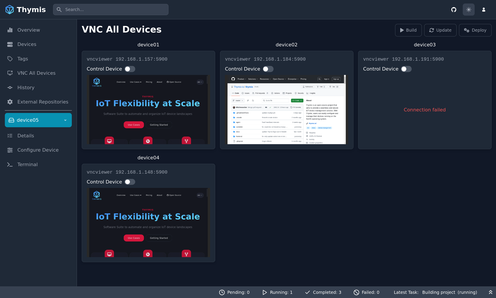
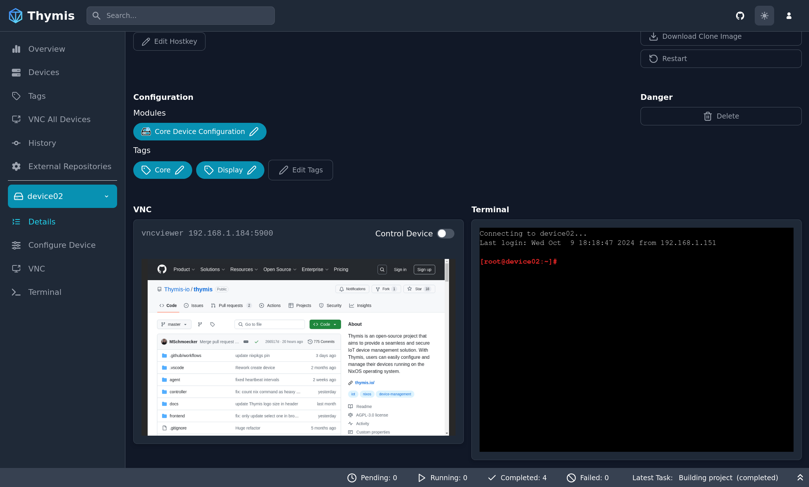

# VNC Usage

The built-in Kiosk module provides a VNC server that allows you to view and interact with the device's screen.

When you enable the VNC server within the Kiosk module, the device will start a VNC server that you can connect to using a VNC client.

There are two places where you can interact with the device's screen:

## 1. VNC tab in the Sidebar

1. Select your device or tag in the sidebar.
2. Click on the **VNC** tab in the sidebar.

You will be presented with a VNC interface to interact with your device or all devices with the selected tag.

## 2. Device Details Page

1. Select your device in the sidebar.
2. Click on the **Details** sidebar tab.

On the device details page, a VNC interface is available at the bottom of the page.

