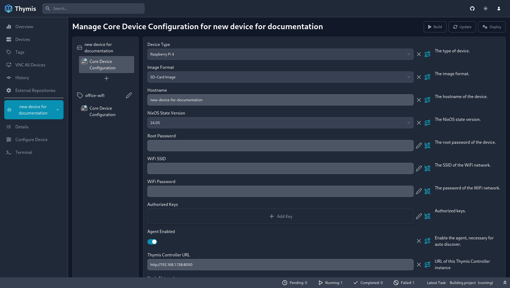

# System Configuration

In the configuration interface, you can set up NixOS modules and services to include in your device's configuration.

## Adding Modules

To add a module to your device's configuration, click on the **Plus** icon below your device's modules list. This will open a dialog where you can search for the module you want to add.

If you want to include custom NixOS module code, use the **Custom Module** option.
This will add a new module to your device's configuration, where you can paste your custom NixOS module code.

## Configuring Modules

To configure a module, click on the module's name in the list.
In the middle pane, you can set the module's options and parameters.
Notice that un-configured options are marked with a pencil icon on the right side of the option.
Filled-in options are marked with an X icon, which you can click to remove the options content.
