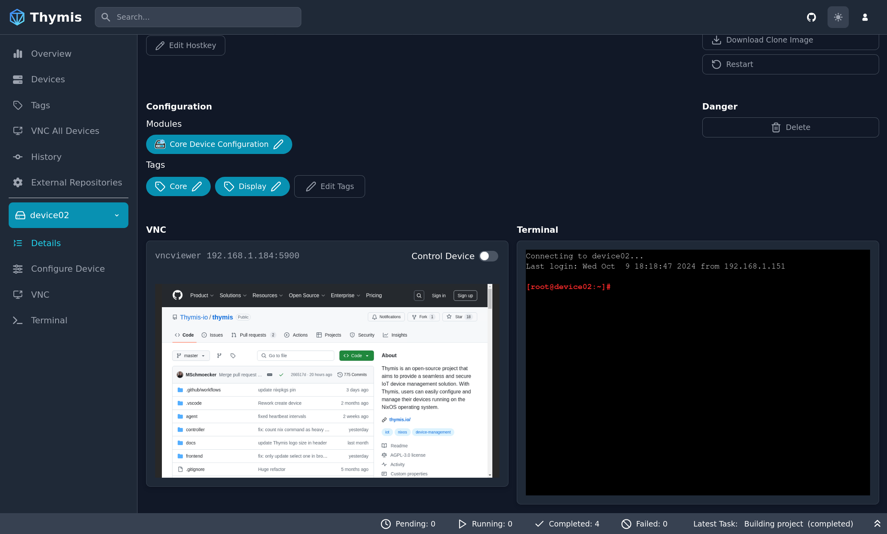

# Terminal Usage

There are two ways to interact with your devices via the terminal:

1. Terminal tab in the Sidebar
2. Device Details page

## Terminal Tab

1. Select your device in the sidebar.
2. Click on the **Terminal** tab in the sidebar.

You will be presented with a terminal interface to interact with your device.

## Device Details Page

1. Select your device in the sidebar.
2. Click on the **Details** sidebar tab.

On the device details page, a small terminal interface is available at the bottom of the page.

